# Microsoft Foundry で基本のエージェントを作成する

## 1. Azure ポータルから Microsoft Foundry リソースを作成

[Azure ポータル](https://portal.azure.com) を開き、画面上部の検索ボックスで "foundry" と入力。表示された **Azure AI Foundry** を選択します。
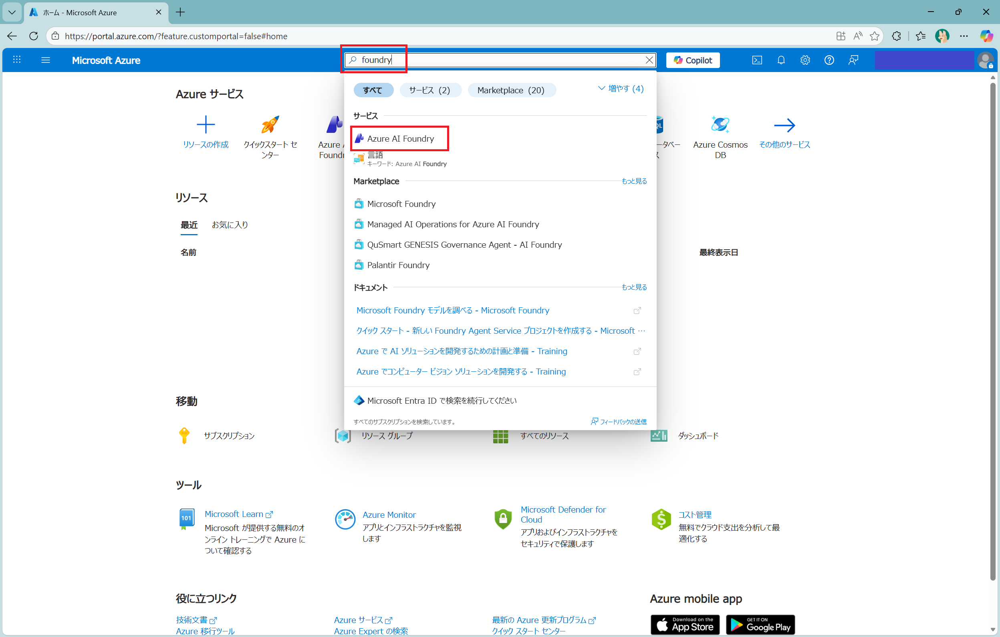

**Microsoft Foundry** のページが表示されたら、右ペインに表示された *Azure AI Foundry のリソース作成* の欄にある **[リソースの作成]** をクリックします。
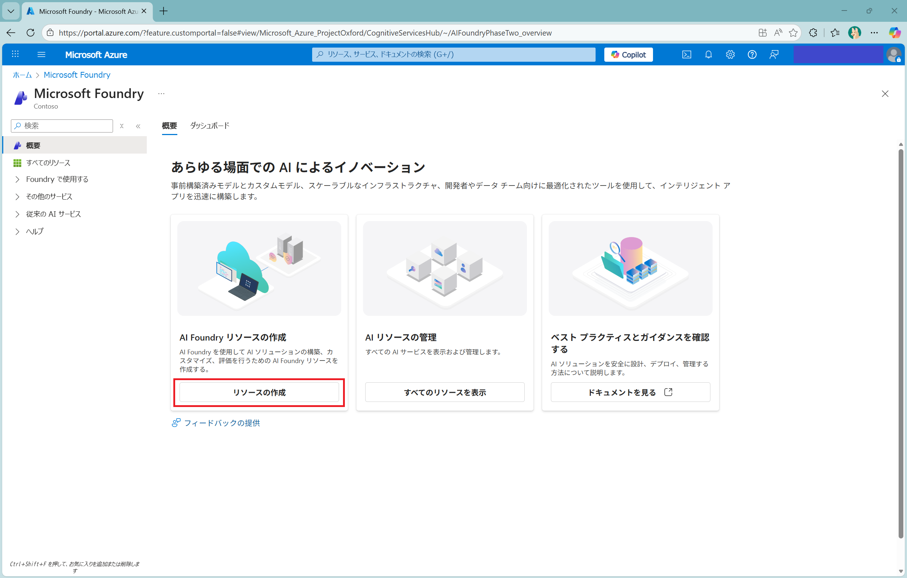

**Create an Foundry Resource** のページで必要な情報を入力、設定していきます。

**[基本情報]** タブ

- **サブスクリプション**: 今回使用する Azure サブスクリプションであることを確認 (異なる場合は正しいものを選択)
- **リソース グループ**: リソースを格納するためのグループを選択
    - 新規作成する場合は、**新規作成** をクリックし、識別しやすい名前を入力して作成
- **名前**: Foundry のリソース名。識別しやすい名前を **英字小文字、数字のみで** 入力
- **リージョン**: 今回は **East US 2** を選択
- **Default project name**: 必要に応じて編集。今回はデフォルト値 (proj-default) のままで問題なし

内容に問題がないことを確認し、画面左下の **[次へ]** をクリックして次の設定へ進みます。

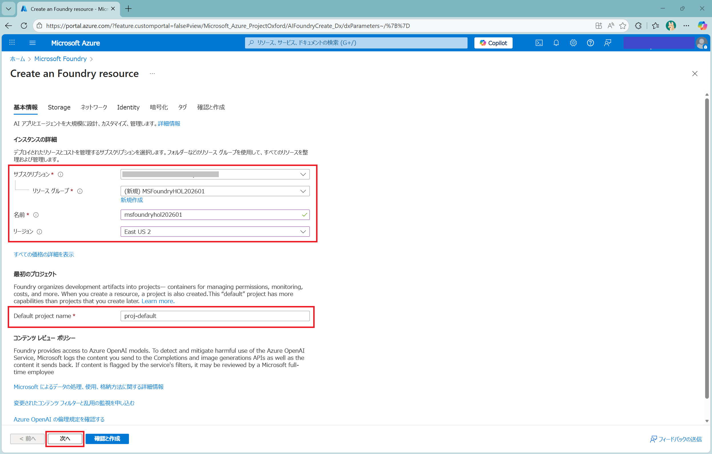

**[Storage]** タブ

> Microsoft Foundry では、ファイルのアップロード、データ出力の作成、データソースやツールに接続する際の認証情報の保存が可能です。基本構成では、この種のデータは Foundry リソース上に直接保存されます。オプションとして、独自の Azure ストレージ ロケーションを使用することもできます。

> - (Option) キーとアプリケーションログの設定
> ※ 本ハンズオンでは設定不要のため、そのままスキップ。Key Vault や Application Insights を使用したログ管理・認証キー管理を行う場合に使用する項目。
> - (Option) エージェント サービスのストレージを設定
> ※ 本ハンズオンでは設定不要のため、そのままスキップ。エージェント サービスを外部ストレージと連携する場合に使用する項目。
> - (Option) 音声/言語サービスのストレージ アカウントを設定
> ※本ハンズオンでは設定不要のため、ここもスキップ。File Upload 等の言語サービス出力を外部ストレージと統合する場合に使用する項目。

画面左下の **[次へ]** をクリックし、次の設定へ進みます。

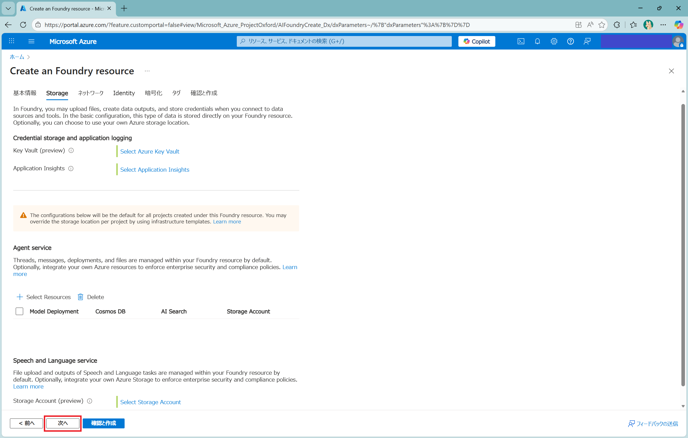

**[ネットワーク]** タブ

**受信アクセス** で **インターネットを含むすべてのネットワークがこのリソースにアクセスできます** を選択します。これは Foundry リソースに外部からアクセスできるようにするための標準設定です。

画面左下の **[次へ]** をクリックし、次の設定へ進みます。

**[Identity]** タブ

Identity の割り当て方法は **システム割り当て** を選択する。これは Foundry リソースが Azure 内で自動的に ID を持ち、必要な権限を利用できるようにするための推奨設定です。

> Microsoft Foundry リソースにアクセスするユーザーは **Azure AI User** の権限が必要である旨が記載されています。

画面左下の **[次へ]** をクリックし、次の設定へ進みます。

**[暗号化]** タブ

> - (option) カスタマー マネージド キー（CMK）を使用するオプション ※本ハンズオンでは変更せず、既定の設定（チェックなし）のまま進める

画面左下の **[次へ]** をクリックし、次の設定へ進みます。

**[タグ]** タブ

>　リソース管理に使用するタグ（名前・値）　を追加できます。
> - (option) 複数のリソースへ一括でタグを適用したい場合は、右側の対象リソースをチェックして選択 ※本ハンズオンではタグ設定は必須ではないため、何も設定せずそのまま進める

画面左下の **[次へ]** をクリックし、最終確認画面へ進みます。

「最終検証を実行しています．．．」というメッセージが表示され、設定内容の検証が行われます。問題なければ、画面左下の **[作成]** をクリックしてリソースのデプロイを開始します。

デプロイが完了したら「リソースに移動」をクリックします。

作成した Foundry のリソース画面表示されます。画面中央にある **[Foundry ポータルに移動]** をクリックし、Microsoft Foundry ポータルへアクセスします。

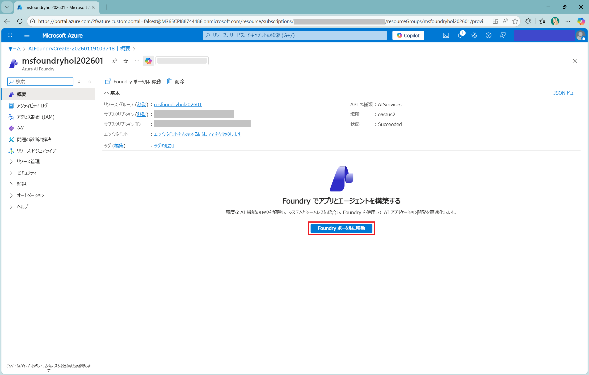

Microsoft Foundry のページが開き、プロジェクトが表示されている状態になっていれば、準備完了です。

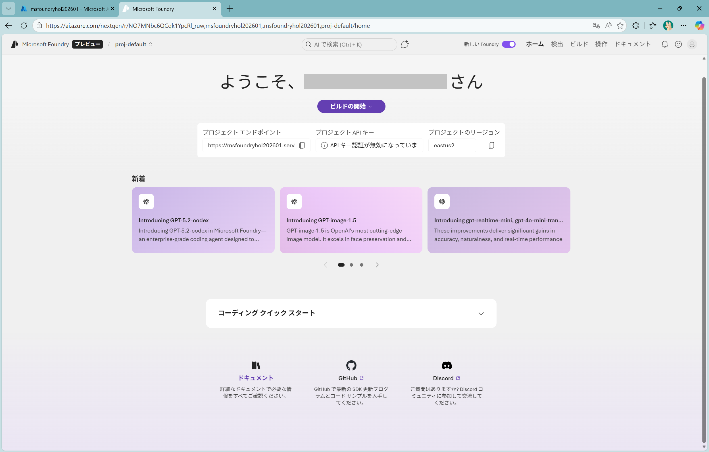

> Microsoft Foundry は https://ai.azure.com からアクセスできます。

> 「ようこそ．．．(Welcome...)」という画面が表示されない場合は、旧ポータルが表示されています。上部バーの **新しい Foundry** (**New Foundry**) をオンにします。 
> 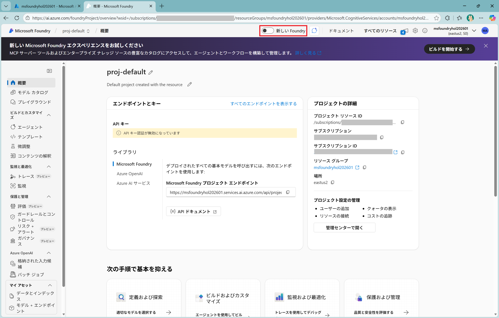

> 英語→日本語表示にしたい場合は、右上のユーザーアイコンをクリックして、設定を変更します。
> 

---

## 2. エージェントの作成

### 2.1 基本のエージェント作成

Foundry ポータルのホーム画面から **[ビルドの開始 (Start building)]** をクリックし、**エージェントの作成 (Create agent)** を選択します。

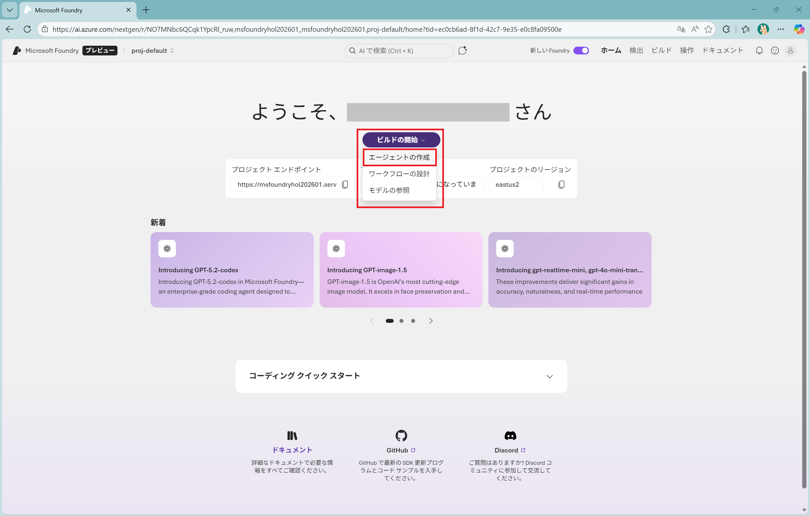

**エージェントの作成 (Create an agent)** ダイアログボックスで **エージェント名 (Agent name)** に識別しやすい名前を入力します。※プロジェクト内で一意にする必要があります

**[作成 (Create)]** をクリックしてエージェントを作成します。

エージェントの作成が完了すると、エージェントのプレイグラウンド(設定、テスト画面)が表示されます。

> エージェントのプレイグラウンドは、画面右上ツールバーの **ビルド** > 左メニューバーの **エージェント** からアクセスできます
>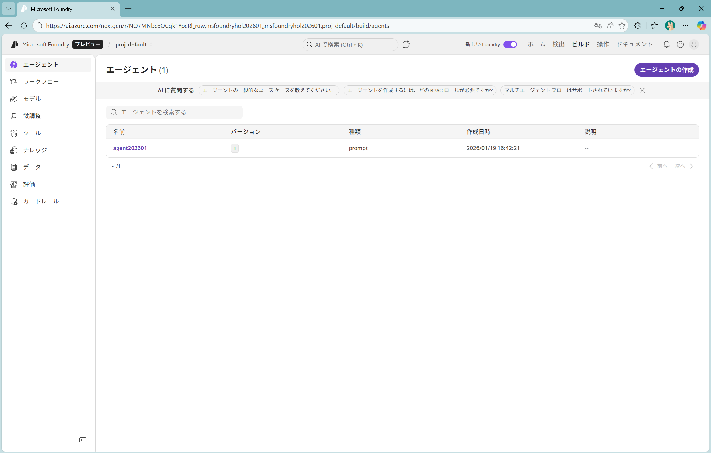

## 2-2. エージェントの手順の設定

エージェントのプレイグラウンド画面の左パネルにある **手順 (Instructions)** の欄に、エージェントへ与える役割や動作方針を記述します。ここに入力した内容が、エージェントの基本的な応答方針として利用されます。

手順に以下のようなシステムプロンプトを入力します。※自由にアレンジしてください

> あなたは情報を見つけるのに役立つ AI アシスタントです。関西弁で回答してください。

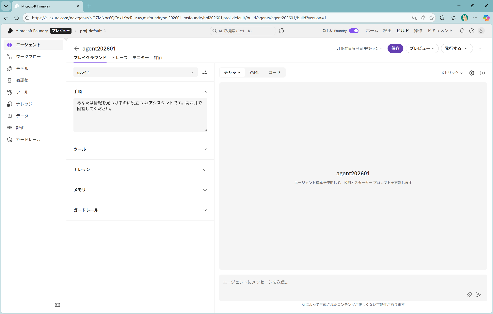

エージェントにメッセージを送信して動作を確認します。画面右側のチャットエリアで、右下のメッセージ欄からメッセージを送信し、エージェントが設定した手順の内容に沿って応答しているかを確認します。

画面右上の **保存** をクリックし、エージェントを保存しておきます。

## 2-3. エージェントのメモリの設定

エージェントのプレイグラウンド画面で **メモリ** 欄を開き、メモリストアに関する設定を表示します。
**メモリストア**のプルダウンをクリックし、**自動作成 (Auto-create memory store)** を選択します。
スイッチを **オン** に切り替えたら、メモリ機能の有効化が完了です。

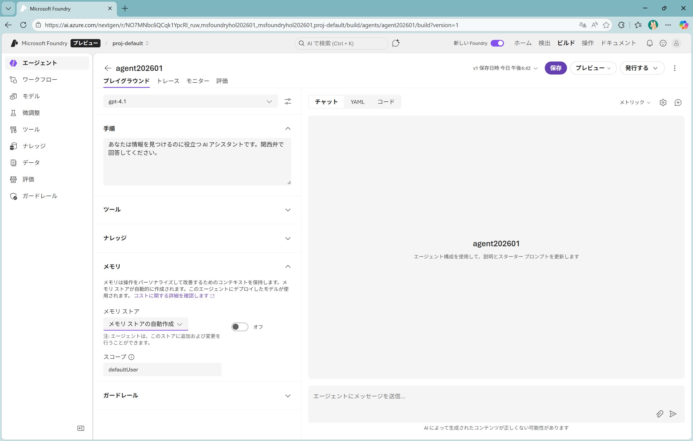

> 2回目以降は必要に応じて、表示される作成済み既存のメモリストアから選択できます
> 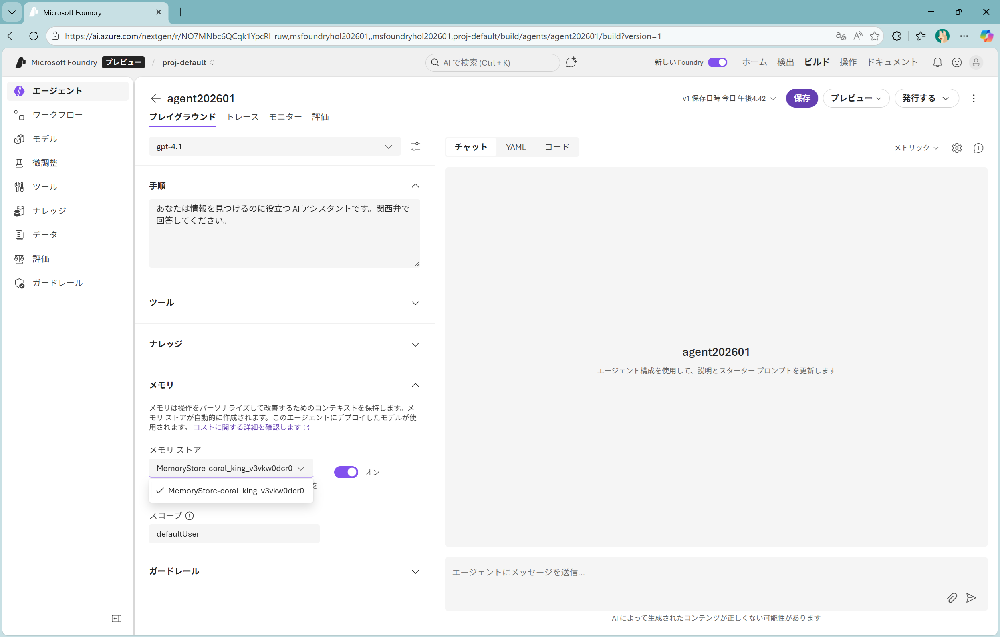

---

## 3. Web 検索エージェントの構築

### 3-1. Web 検索ツールの追加

[Microsoft Foundry ポータル](https://ai.azure.com) を開き、画面右上ツールバーの **ビルド** > 左メニューバーの **エージェント** の画面を開き、2 で作成したエージェントを参照します。

プレイグラウンド画面から、**ツール** をクリックして開き、**[追加]** をクリックします。

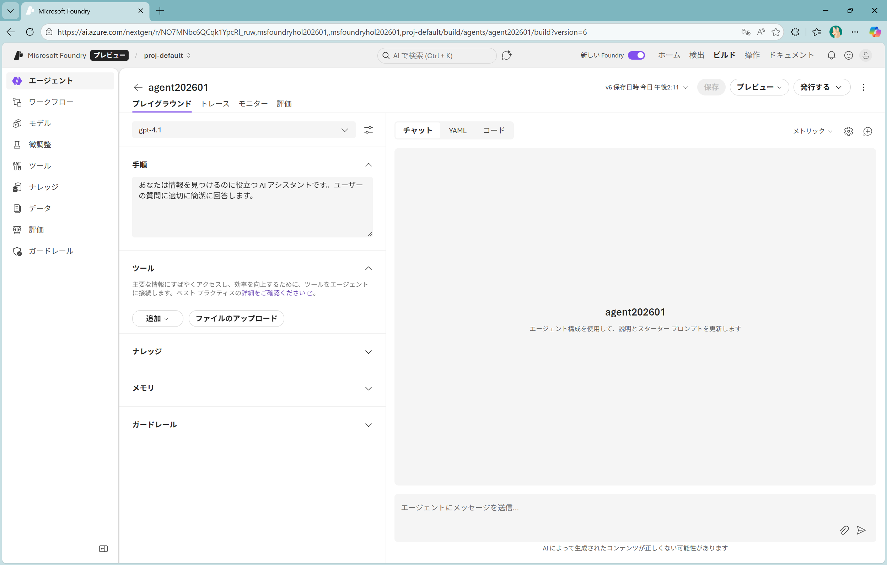

**ツールの選択** ダイアログ画面で、**Web 検索** を選択し、**[ツールを追加]** をクリックします。

**Web 検索ツールの追加** ダイアログ画面が開きます。**追加** をクリックします。

Web 検索を追加できたら、**保存** をクリックして、構成を保存しておきます。

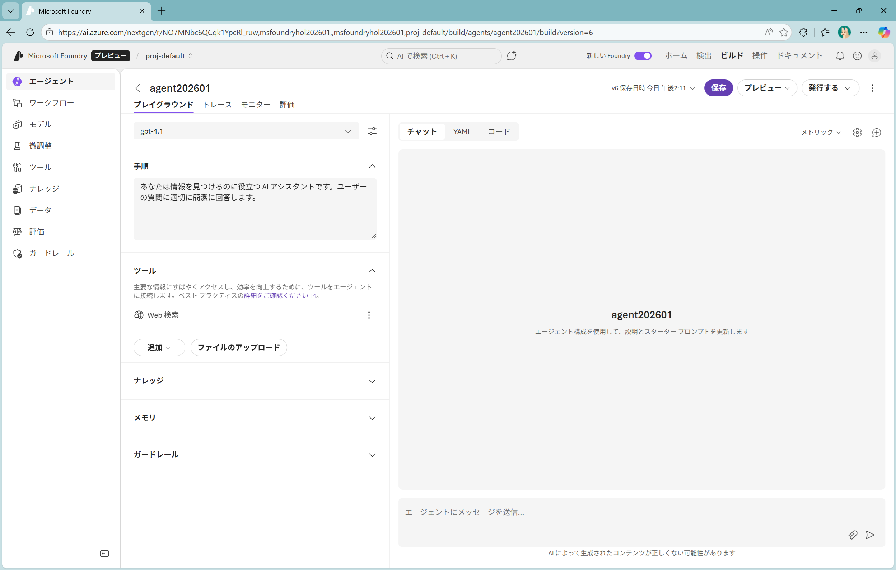

### (Option) 3-2. Grounding with Bing Search の追加

3-1 の手順で Web 検索ツールが追加できない場合は、以下の手順で Grounding with Bing Search の追加を行ってください。

[Azure ポータル](https://portal.azure.com) を開き、画面上部の検索ボックスで "**bing**" と入力。表示された **Bing リソース** を選択します。

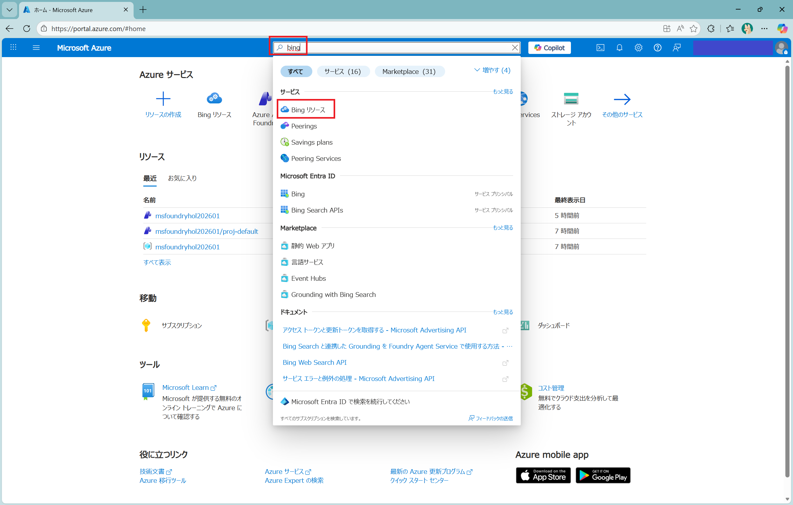

**Bing リソース** の画面で、**+追加** をクリックして **+Grounding with Bing Search** を選択します。

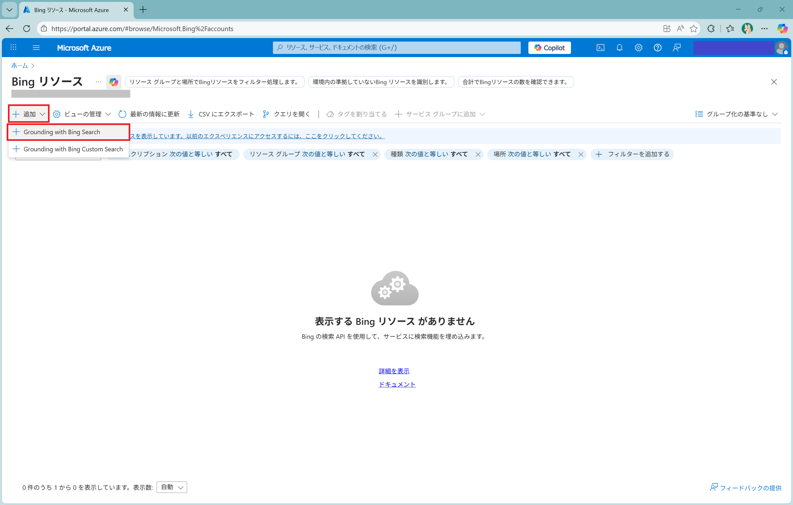

**Create a Grounding with Bing Search resource** の画面で必要情報を設定、確認します。

- **サブスクリプション**: 今回使用する Azure サブスクリプションであることを確認 (異なる場合は正しいものを選択)
- **リソース グループ**: Foundry を作成したリソースグループを選択
- **名前**: Grounding with BingSearch のリソース名。識別しやすい名前を入力 ("*Foundry名*-bing" など)
- **リージョン**: グローバル
- **価格レベル**: Grounding with Bing Search

- **ご契約条件**: 「上記通知を読み、理解しました」にチェック

画面左下の **[次へ]** をクリックし、最終確認画面へ進みます。

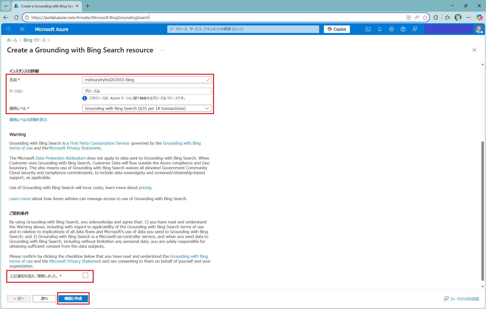

「最終検証を実行しています．．．」というメッセージが表示され、設定内容の検証が行われます。問題なければ、画面左下の **[作成]** をクリックしてリソースのデプロイを開始します。

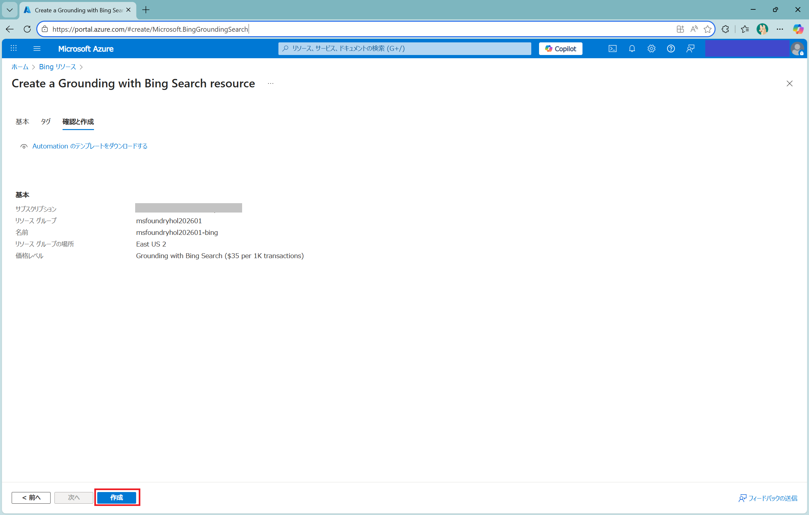

デプロイが終了したら完了です。

[Microsoft Foundry ポータル](ai.azure.com) を開き、2 で作成したエージェントを参照します。

プレイグラウンド画面から、**ツール** をクリックして開き、**[追加]** をクリックします。

**ツールの選択** ダイアログ画面で、**Bing 検索を使用したグラウンド** を選択し、**[ツールを追加]** をクリックします。

**Bing 検索ツールを使用してグラウンドを追加する** ダイアログ画面が開きます。

**Bing 検索接続を使用した典拠** をクリックして **新しいリソースに接続する** を選択します

**新しい接続の作成** ダイアログ画面で、**Bing 検索を使用したグラウンド** に 3-1. の手順で作成した Grounding with Bing Search を選択して、**[接続]** をクリックします。

**Bing 検索ツールを使用してグラウンドを追加する** ダイアログ画面に戻ってくるので、設定を入力します。

- **数**: 5 ※今回はデフォルトのまま
- **言語の設定**: ja ※日本語の場合
- **市場**: ja-jp ※日本を対象とする場合
- **更新の間隔**: (option) データの範囲を限定したい場合に使用 ※今回はブランクのまま

画面右下の **追加** をクリックし、Bing Search ツールの追加を完了します。

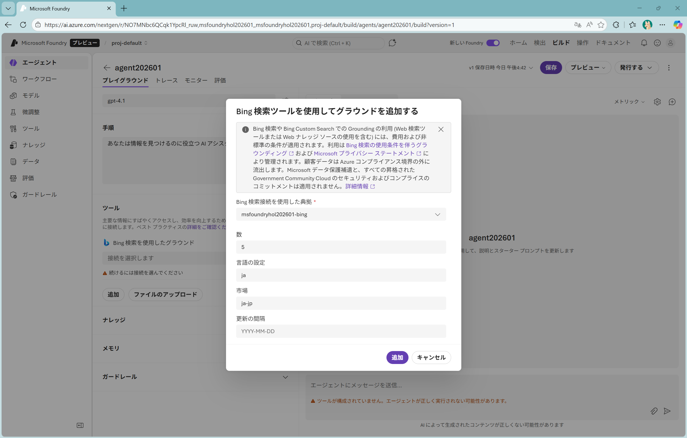

Bing 検索を追加できたら、**保存** をクリックして、構成を保存しておきます。

### 3-3. Web 検索機能の確認

エージェントにメッセージを送信して動作を確認します。画面右側のチャットエリアで、右下のメッセージ欄からメッセージを送信し、エージェントが設定した手順の内容に沿って応答しているかを確認します。新しい情報を取得する (＝Bing Searchを使用する) メッセージを送信します。

> エージェントが Bing Search を使った場合、応答メッセージの下に、Bing Search を使ってグラウンディングした (＝エージェントの応答に使われた元ネタ) Web URL が表示されます。
> 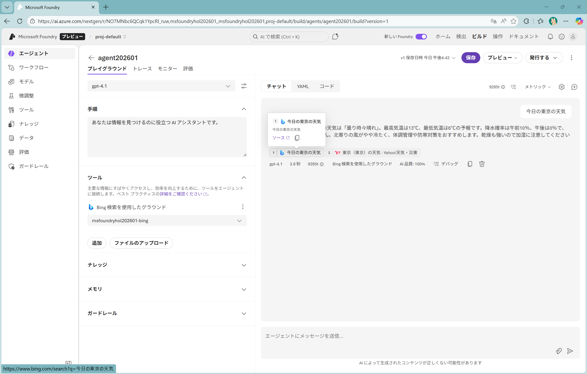

> 応答の評価検証が自動で実行され、**AI 品質** に表示されます。
> 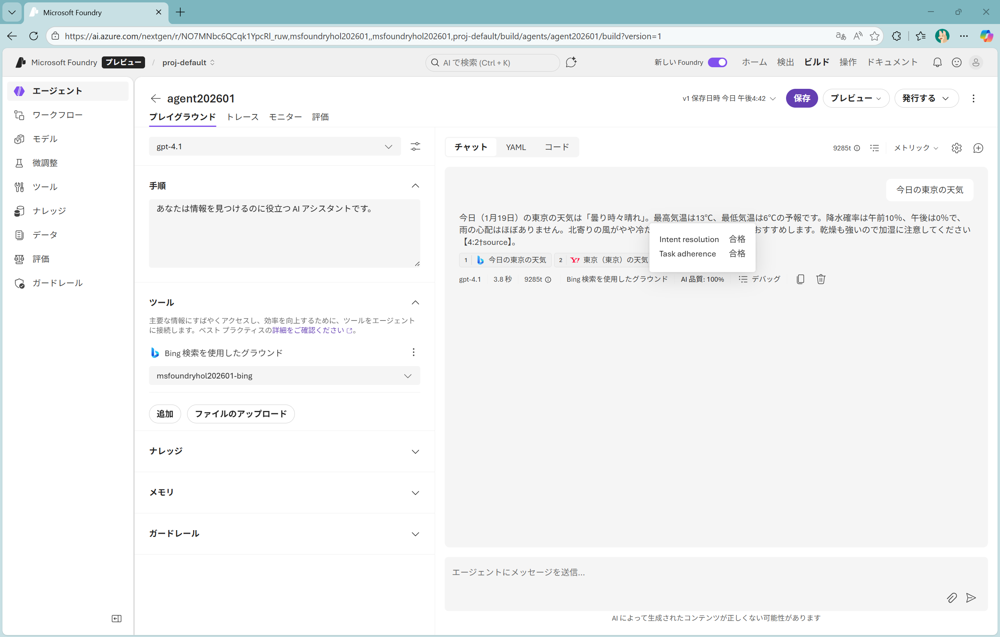

エージェントの動作を確認します。エージェントからの応答メッセージの下にある **Debug** をクリックします。

ツールの利用状況や入出力、メタデータ、評価の詳細を確認することが出来ます。

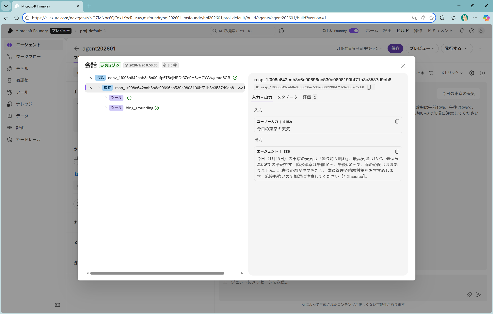
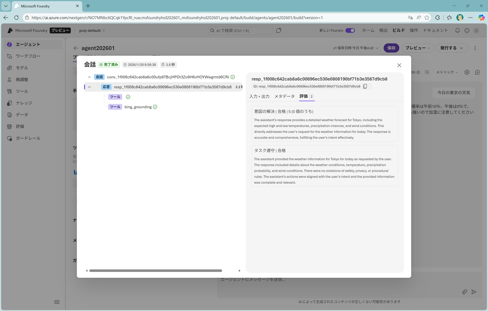

## 4. トレース機能の有効化
### 4-1. Application Insights の追加

[Azure ポータル](https://portal.azure.com) を開き、画面上部の検索ボックスで "**app insights**" と入力。表示された **Application Insights** を選択します。

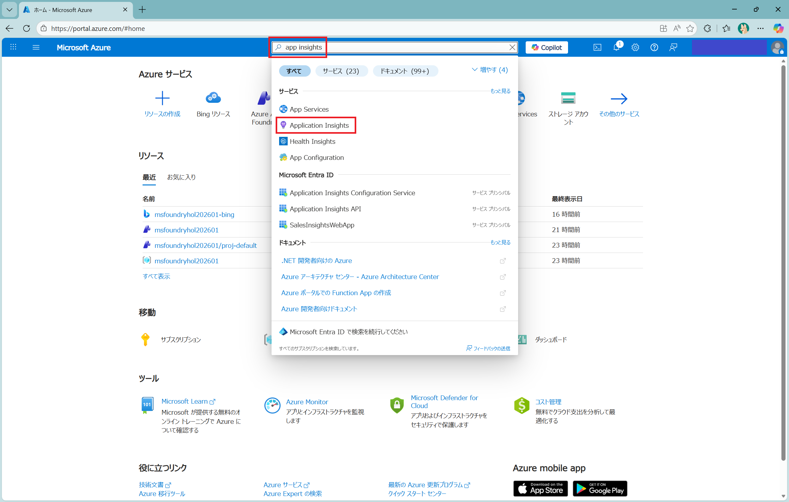

**Application Insights** の画面で、**+作成** をクリックします。

**Application Insights** の新規作成画面で必要情報を設定、確認します。

- **デプロイの詳細**
    - **サブスクリプション**: 今回使用する Azure サブスクリプションであることを確認 (異なる場合は正しいものを選択)
    - **リソース グループ**: Foundry を作成したリソースグループを選択
- **インスタンスの詳細**
    - **名前**: Grounding with BingSearch のリソース名。識別しやすい名前を入力 ("*Foundry名*-appinsights" など)
    - **地域**: Foundry と同じ場所を選択 (今回は **East US 2**)
- **ワークスペースの詳細**
    - **サブスクリプション**: *デプロイの詳細* で選択しているサブスクリプションを選択
    - **Log Analytics ワークスペース**: 新規作成そのままにする (既存のワークスペースを選択しても OK)

画面左下の **[Review + create]** をクリックし、最終確認画面へ進みます。

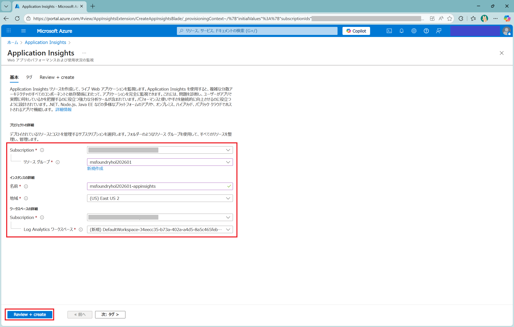

設定内容の検証が行われます。問題なければ、画面左下の **[作成]** をクリックしてリソースのデプロイを開始します。

デプロイが終了したら完了です。

### 4-2. エージェントのトレース機能の有効化

[Microsoft Foundry ポータル](https://ai.azure.com) を開き、画面右上ツールバーの **ビルド** > 左メニューバーの **エージェント** から 1～3 で作成、編集したエージェントを開く

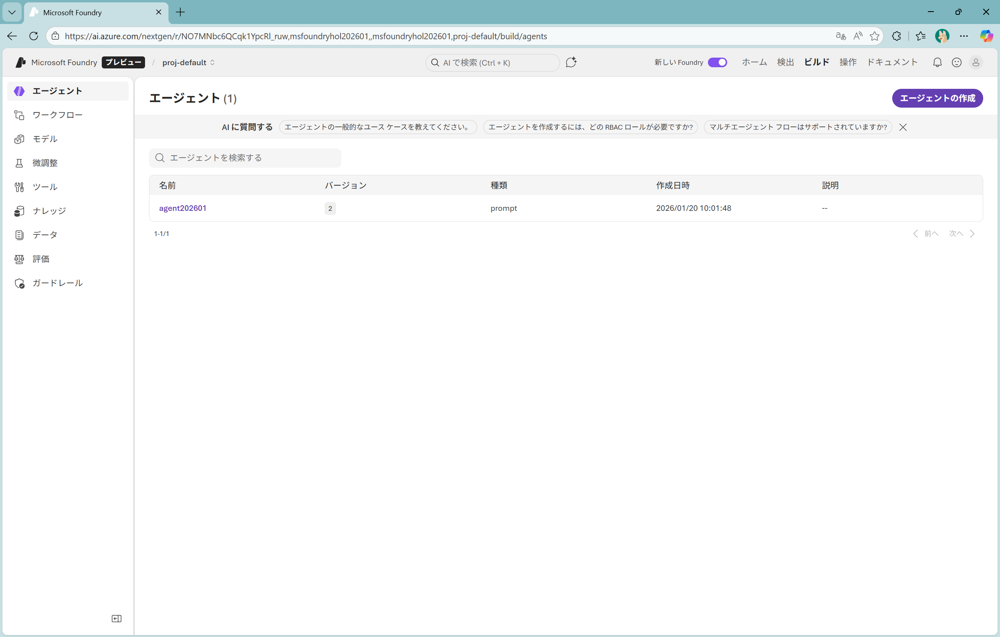

エージェントの画面から **トレース** タブを開きます。Application Insights リソースに接続して監視とトレース機能を有効化するため、画面上部右側の **[接続する]** をクリックします。

**モニターの設定** ダイアログ画面が開きます。**Application Insights のリソース名** に作成した Application Insights を選択し、**[接続]** をクリックします。

### 4-3. エージェントのトレース機能の確認

トレースの設定が完了したら、**プレイグラウンド** タブに戻ります。
手順を適時調整して、チャット画面でメッセージを送信します。Bing Search ツールを使用するようにするには「最新の(情報)」と入力します。

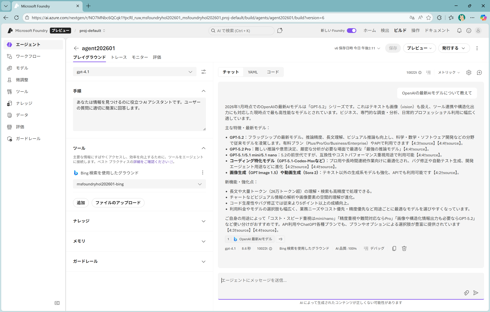

エージェントからの応答が完了したら、トレースを確認します。**Traces** タブを開き、実行ログ（応答 ID / トレース ID / 会話 ID / 状態 など）が記録されていることを確認します。**状態** が *✓完了** になっていれば正常に動作している状態です。

> **会話ID** をクリックすると、プレイグラウンドのチャット画面で応答に表示されるデバック情報が表示されます。

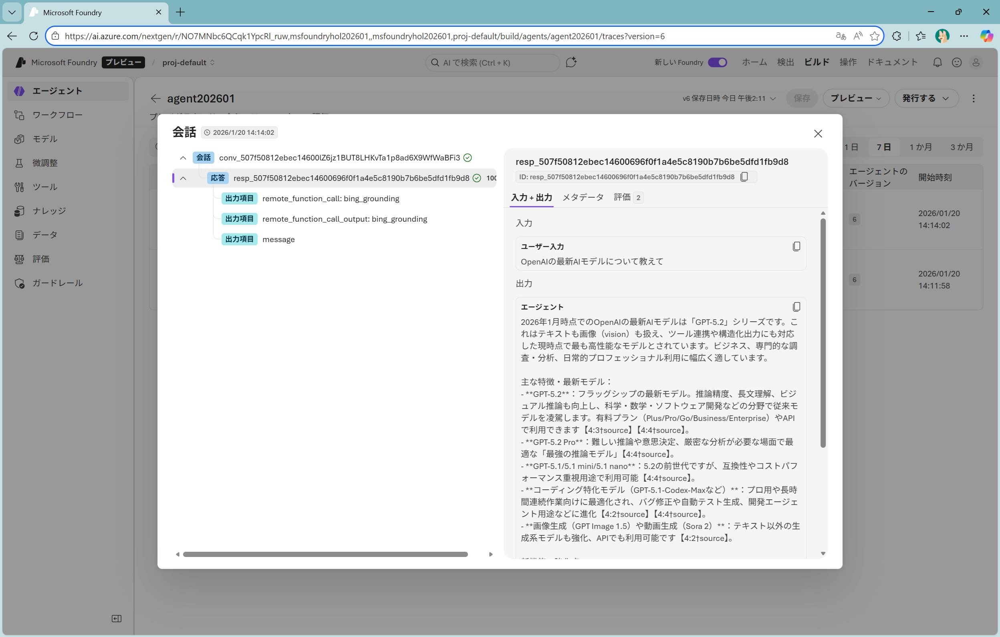

**モニター** タブを開きます。モニター画面では実行回数、トークン使用量、エラー率などのメトリクスを確認できます。

## 5. モデルの追加デプロイ

Foundry リソースを作成すると、GPT-4.1 や text-embedding-3-small など、いくつかの基本モデルがデフォルトでデプロイされています。これ以外のモデルを利用したい場合は、追加でモデルのデプロイを行います。

画面右上ツールバーの **ビルド** > 左メニューバーにある **モデル** をクリックして、モデル一覧画面を表示します。
右上の **基本モデルをデプロイする** をクリックし、デプロイ可能なモデルの一覧を開きます。

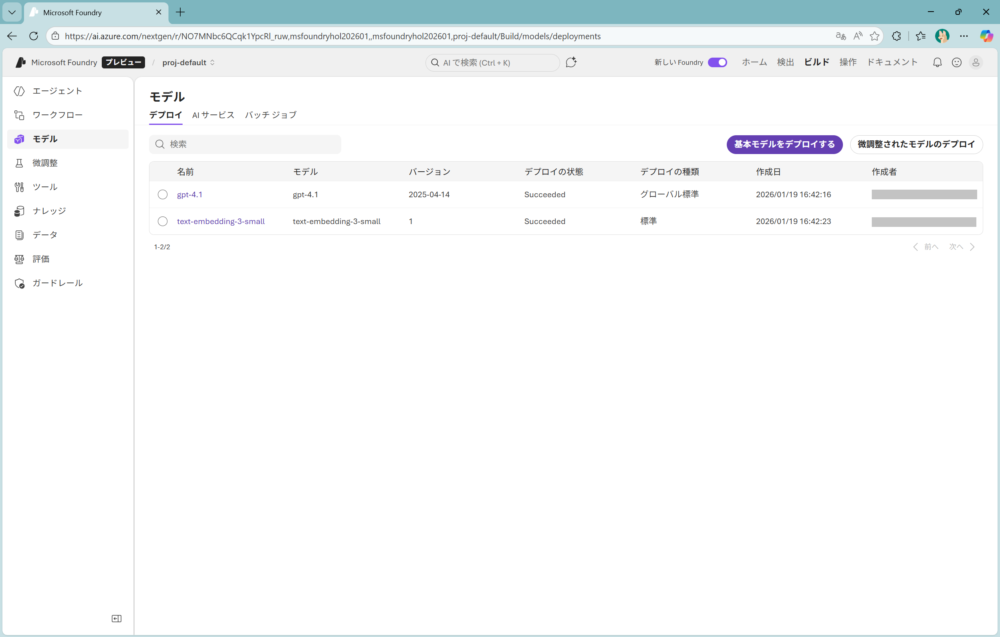

一覧からデプロイしたいモデルをクリックして選択します。ここでは **model router** をクリックします。

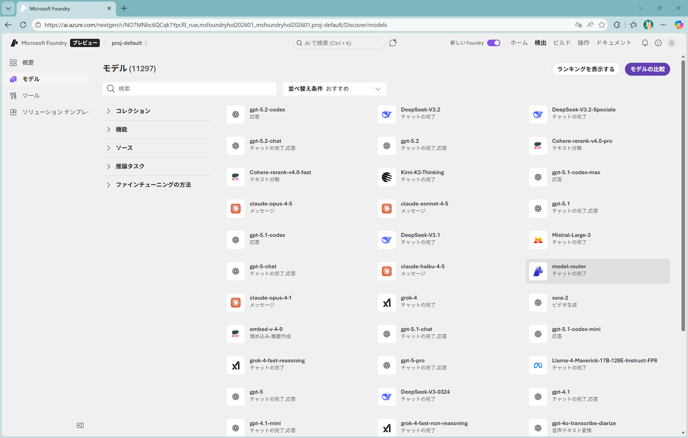

** model-router** のデプロイ画面の右上にある [**デプロイ**] をクリックし、ここでは **既定の設定** をクリックしてデプロイします。

> モデルのデプロイ時に **カスタム設定** を選択すると、種類、構成などをデプロイ時に設定できます。後からも変更可能です。
> 

「モデルをデプロイしています．．．」というメッセージが表示され、デプロイが終了すると、モデルのプレイグラウンドが表示されます。

モデル プレイグラウンドで Model Router の挙動を確認します。画面右側のチャットエリアでメッセージを送信し、応答を確認します。

応答の下には Model Router で選択されたモデル名が表示されます。

モデルのプレイグラウンド画面の右上にある **[モデルの比較]** をクリックして、他のモデルと動作を比較します。ここではデプロイ済みの **gpt-4.1** を選択します。

比較画面では、左右に異なるモデルを配置でき、同じプロンプトに対する 応答品質・内容の違い を並べて確認できます。
エージェントにメッセージを送信して動作を確認します。チャットエリアでメッセージを送信し、応答を確認します。モデルの違いを確認できます。

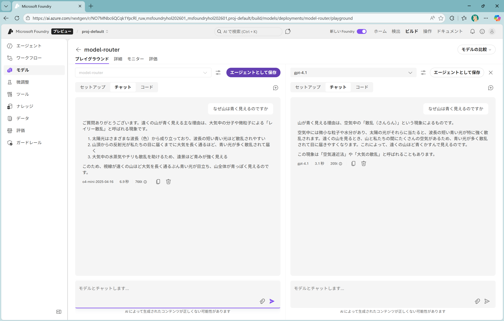

---

## 6. MCP サーバーを利用したエージェントの構築

### 6-1. リモートMCPサーバーを追加したエージェントの作成

画面右上ツールバーの **ビルド** > 左メニューバーにある **エージェント** をクリックして、画面右上の **エージェントの作成** をクリックし、新規エージェントを作成します。

**エージェントの作成** ダイアログボックスで **エージェント名** に識別しやすい名前を入力します。※プロジェクト内で一意にする必要があります
**[作成 (Create)]** をクリックしてエージェントを作成します。

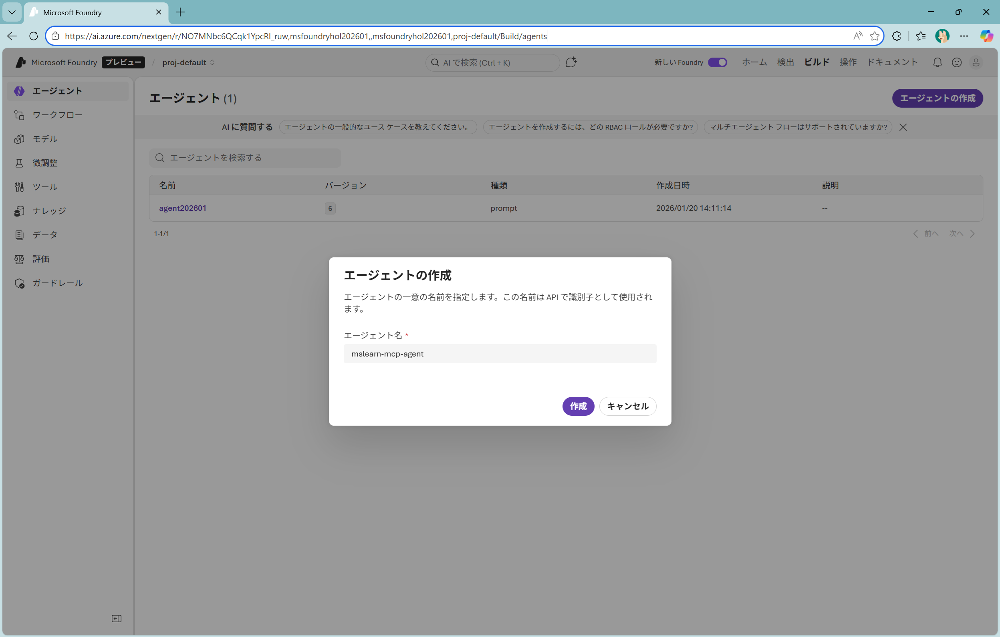

エージェントが作成されたら、エージェントのプレイグラウンド画面の左パネルにある **ツール** をクリックして開き、**追加** > **+新しいツールの追加** をクリックします。

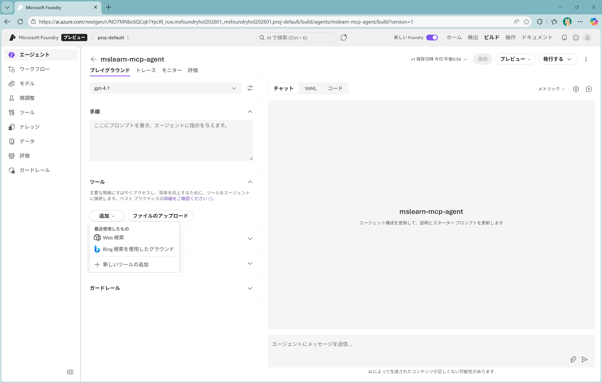

**ツールの選択** ダイアログ画面で、**カタログ** タブをクリックします。
検索バーの下にある絞り込み条件から **型** をクリックして、**リモートMCP** を選択します。検索バーに **Microsoft Learn** と入力します。
表示されたツールから **Microsoft Learn** を選択して、右下の **[作成]** をクリック、Microsoft Learn の情報を提供する MCPサーバーを追加します。

**Microsoft Learn ツールを接続する** ダイアログ画面で、名前や認証はデフォルトのままで、右下の **接続** をクリックして、MCPサーバーの追加を完了します。

### 6.2 エージェントからの MCP ツール利用の確認

エージェントの手順に、MCP ツールを利用する前提の役割説明やガイドを記載します。
例えばここでは、プレイグラウンド画面から手順の欄に **Microsoft Learn の情報を分かりやすくまとめて案内するエージェントです。** と記載します。

プレイグランド画面右側のチャットで、エージェントに MCPサーバーで情報を取得するようなメッセージを送信します。
例えばここでは、メッセージ欄に **Microsoft Foundryでの MCP Toolの利用法は？** と入力して送信します。

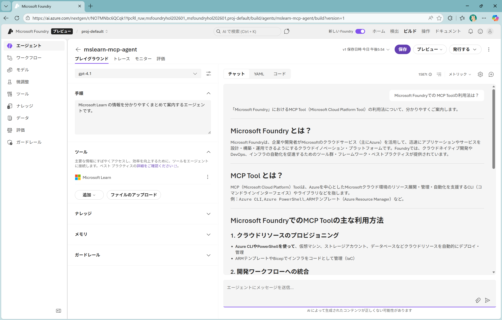

> エージェントが MCP ツールへアクセスしようとしたとき、承認ダイアログが表示される場合は **承認** をクリック、適切な許可を選択します。ここでは **このツールを常に確認せずに承認する** を選択します。
> 

エージェントが MCP サーバーと連携できているか動作確認をするため、応答メッセージの下に表示される **デバッグ** をクリックします。

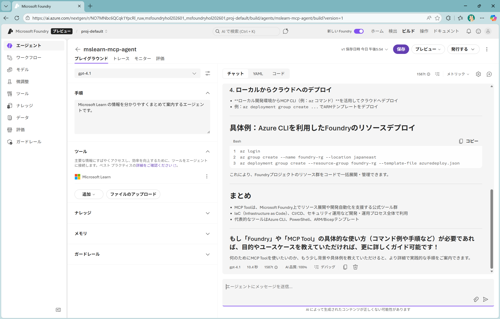

会話のログに MCP サーバーのツール呼び出しが記録されていることを確認します。

## 7. エージェントのバージョン管理

[Microsoft Foundry ポータル](https://ai.azure.com) を開き、画面右上ツールバーの **ビルド** > 左メニューバーの **エージェント** を開き、1～6 で作成、編集したエージェントを開きます。
画面上部のバージョン番号をクリックして、バージョン管理メニューを表示、**バージョンの比較** をクリックします。

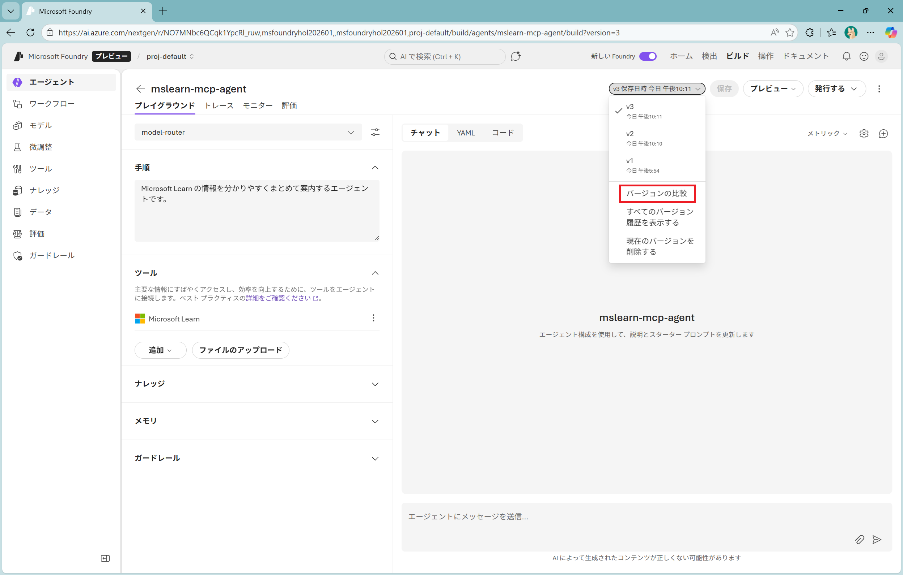

分割された各画面の上部にあるバージョン番号をクリックして、比較したいバージョンに変更します。
メッセージ欄にメッセージを入力して送信し、各バージョンのエージェント応答を確認します。バージョンの違いを確認できます。

