# Microsoft Foundry でマルチエージェントを作成する

専門のエージェントをワークフローで呼び出すマルチエージェントを作成します。


## 1. 専門エージェントの作成

ワークフローで呼び出すための 3 種類の専門エージェントを先に作成していきます。

### 1-1. トピック分類エージェント

[Microsoft Foundry ポータル](https://ai.azure.com) を開き、画面右上ツールバーの **ビルド** > 左メニューバーの **エージェント** の画面を開きます。**[エージェントの作成]** をクリックして、新規エージェントを作成します。

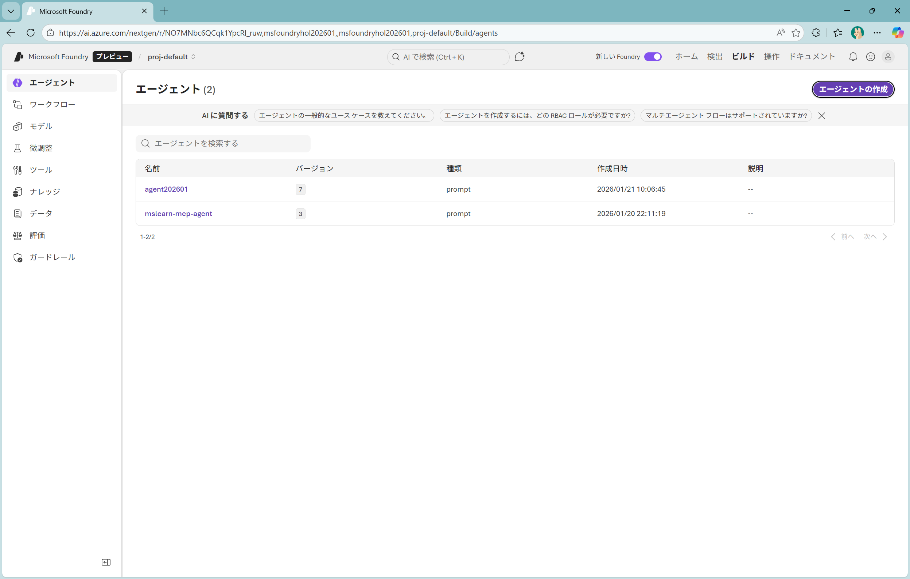


エージェント名に **routing-agent** と入力、**[作成]** をクリックして作成を完了します。

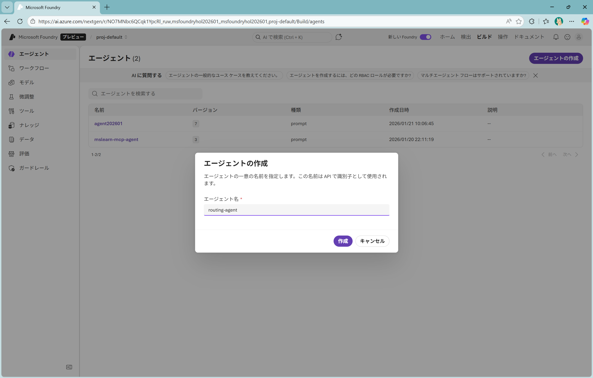


routing-agent の **手順**に以下をプロンプトを入力します。

```txt
入力されたトピックを以下の選択肢に分類してください。選択肢の回答のみを回答して
- Microsoft
- その他
```

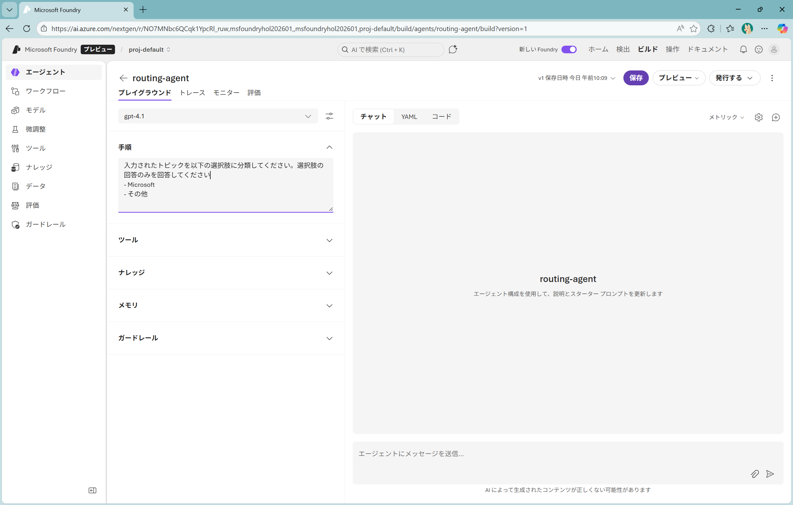

パラメーターボタンをクリック、テキスト形式から **JSON スキーマ** を選択します。

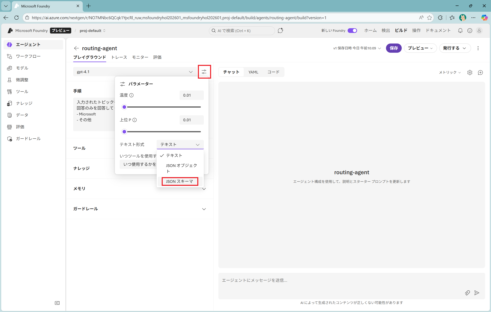

**応答形式の追加** ダイアログ画面で、**定義** を以下の通りに書き換えます。(コピーして貼り付けてください)
**保存** をクリックして JSON スキーマを保存します。

```json
{
   "name":"routing_response",
   "schema":{
      "type":"object",
      "properties":{
         "Type":{
            "type":"string",
            "enum":[
               "Microsoft",
               "Other"
            ]
         },
         "name":{
            "type":"string"
         },
         "steps":{
            "type":"array",
            "items":{
               "type":"object",
               "properties":{
                  "explanation":{
                     "type":"string"
                  },
                  "output":{
                     "type":"string"
                  }
               },
               "required":[
                  "explanation",
                  "output"
               ],
               "additionalProperties":false
            }
         }
      },
      "required":[
         "Type",
         "name",
         "steps"
      ],
      "additionalProperties":false
   },
   "strict":true
}
```

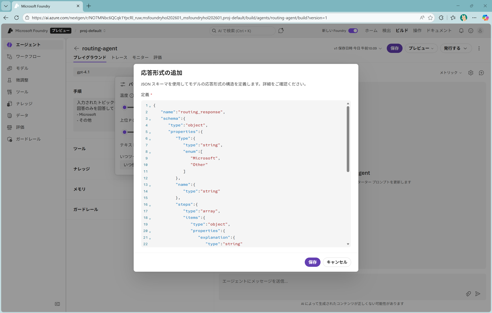

チャット画面でメッセージを送信して routing-agent の動作を確認します。**[保存]** をクリックして、エージェントの設定内容を保存しておきます。

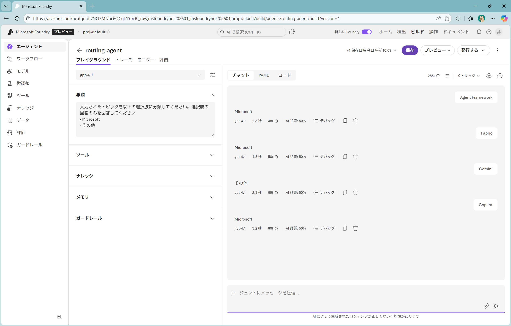


### 1-2. Microsoft情報調査エージェント

今回は Grounding with Bing Custom Search を使ってWebから最新情報を取得します。

[Azure ポータル](https://portal.azure.com) を開き、画面上部の検索ボックスで "**bing**" と入力。表示された **Bing リソース** を選択します。

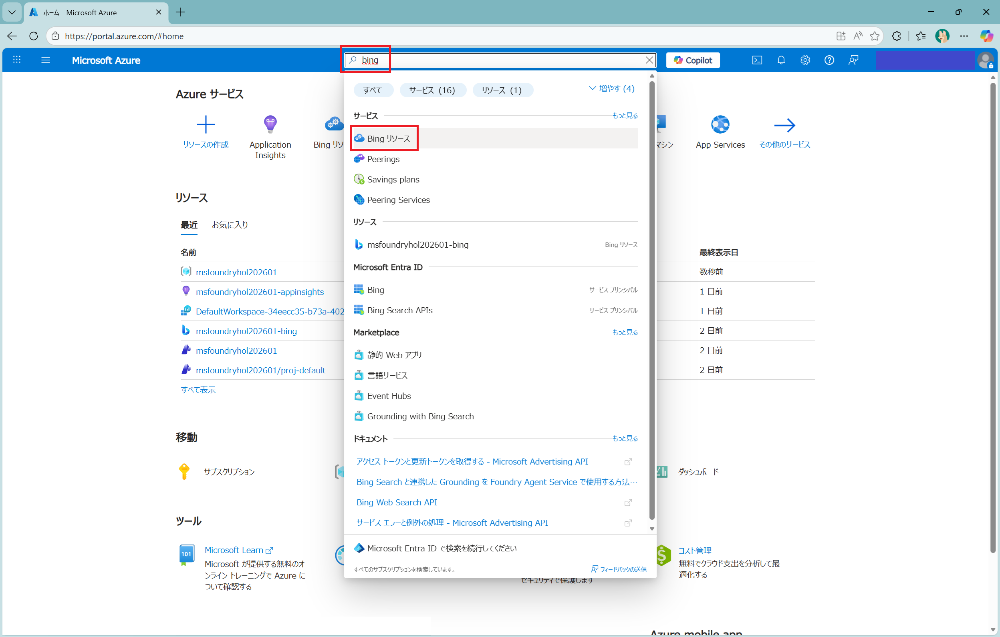

**Bing リソース** の画面で、**+追加** をクリックして **+Grounding with Bing Custom Search** を選択します。

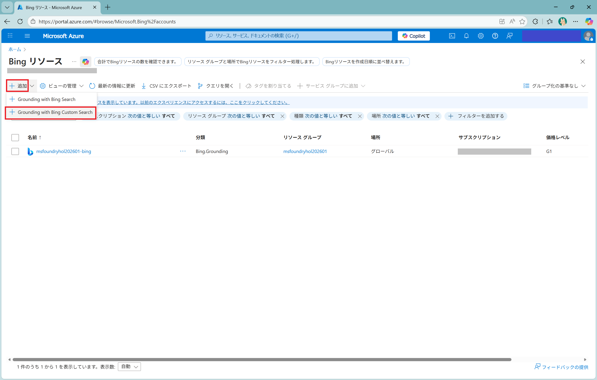

**Create a Grounding with Bing Custom Search resource** の画面で必要情報を設定、確認します。

- **サブスクリプション**: 今回使用する Azure サブスクリプションであることを確認 (異なる場合は正しいものを選択)
- **リソース グループ**: Foundry を作成したリソースグループを選択
- **名前**: Grounding with Bing Custom Search のリソース名。識別しやすい名前を入力 ("*Foundry名*-bingcustom" など)
- **リージョン**: グローバル
- **価格レベル**: Grounding with Bing Custom Search

- **ご契約条件**: 「上記通知を読み、理解しました」にチェック

画面左下の **[次へ]** をクリックし、最終確認画面へ進みます。

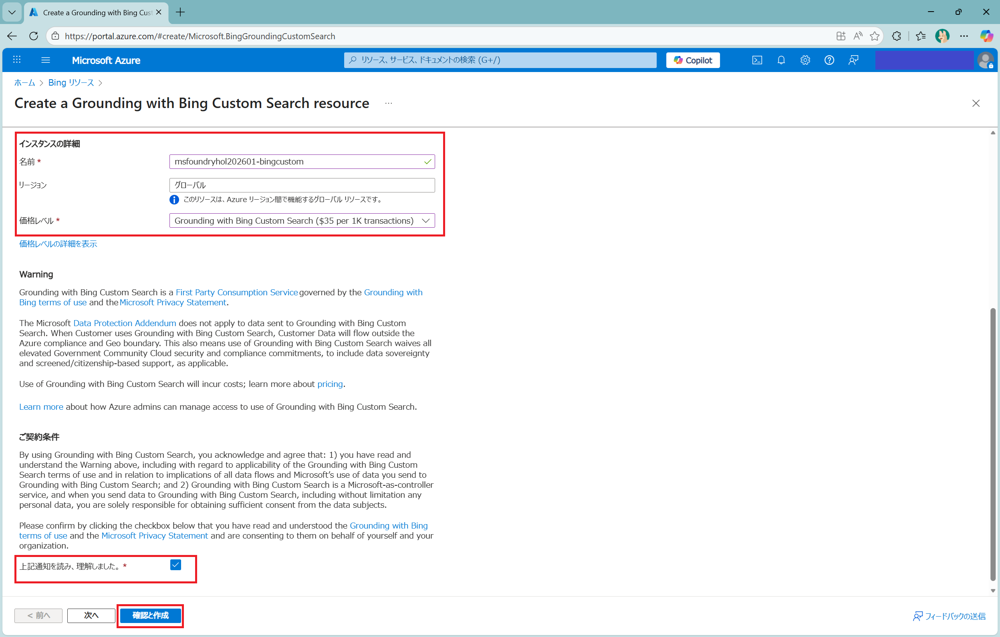

「最終検証を実行しています．．．」というメッセージが表示され、設定内容の検証が行われます。問題なければ、画面左下の **[作成]** をクリックしてリソースのデプロイを開始します。

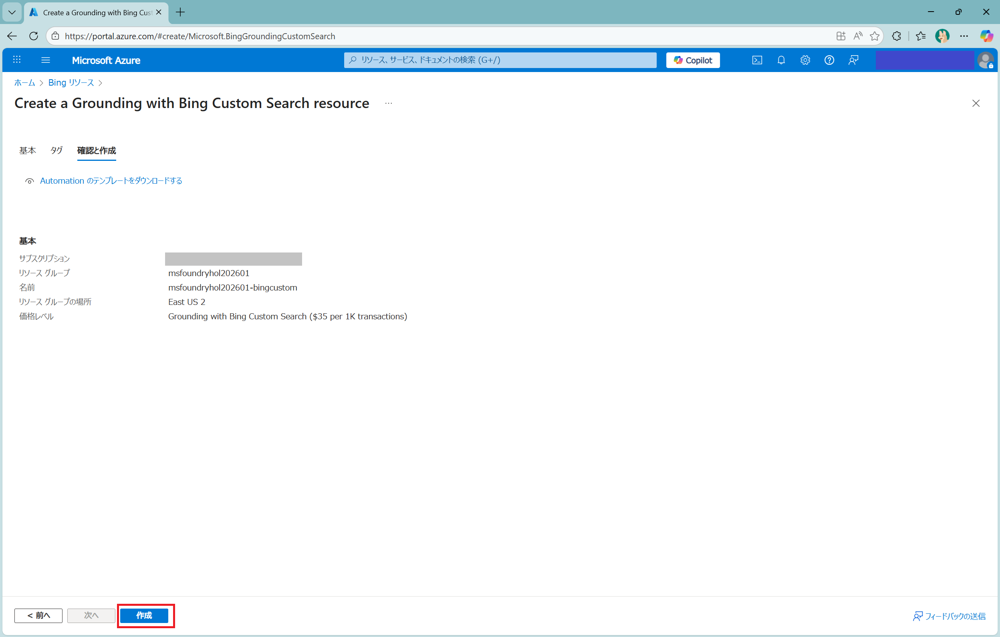

デプロイが完了したら、**[リソースに移動]** をクリックして設定を行います。

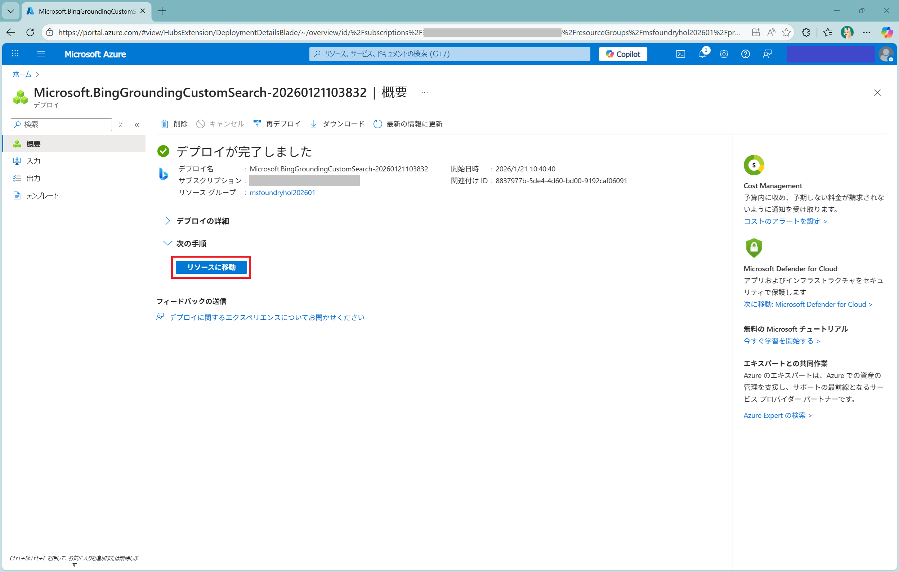

デプロイが完了した Grounding with Bing Custom Search の画面が開きます。左メニューバーから **> リソース管理** をクリックして開き、**Configurations** をクリックします。**Configrations** の画面中央の **[Create new configuration]** をクリックします。


**[Create new configuration with Bing Custom Search]** の画面で、以下の情報を入力します。

- **Configuration Name**: Bing Custom Search の設定名。**microsoft-search** など、識別しやすいものを入力
- **Domains** > **Allowed domains**: 以下の 3種類の URL を入力。1行入力し終わったら、右端の **+** をクリックして入力を確定する

   - https://learn.microsoft.com/
   - https://www.microsoft.com/
   - https://azure.microsoft.com/

設定を入力したら、画面下部の **[Create new configration]** をクリックして、設定を保存します。

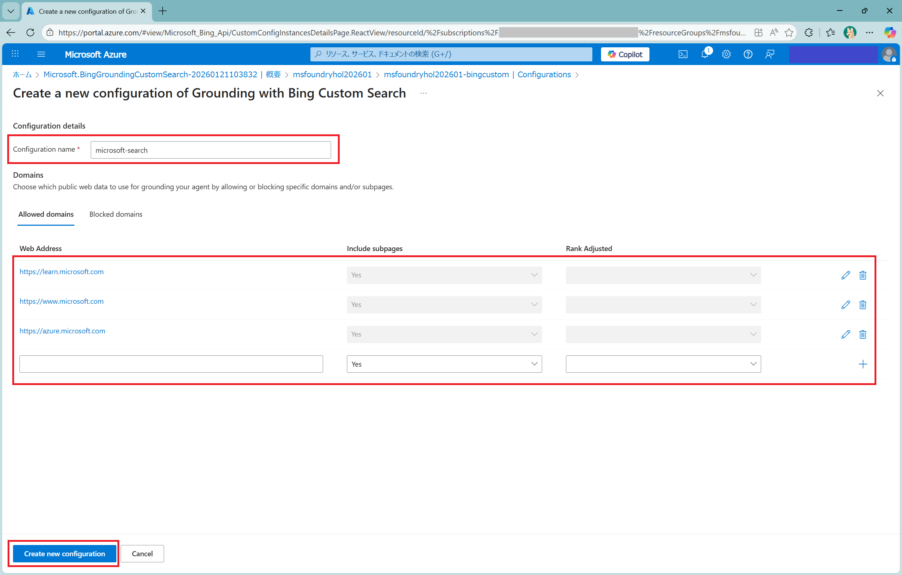

**Configuration** の画面に、設定した Configuration が表示されれば、設定は完了です。

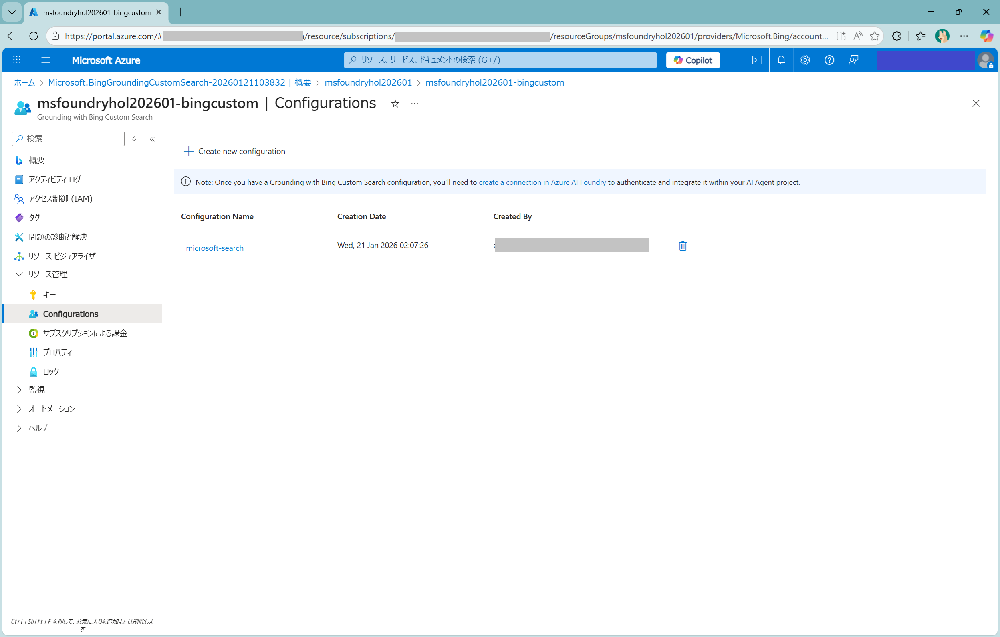


Microsoft Foundry Portal に戻って、トピック分類エージェントと同様に、新規エージェントを作成します。名前は **microsoft-search-agent** と入力します。

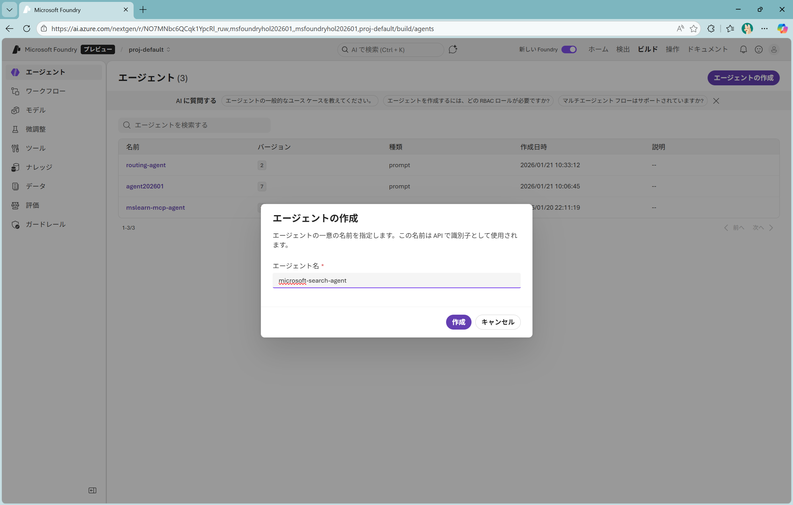


エージェントの手順に、以下のプロンプトを入力します。

```
マイクロソフトの製品やサービスについての情報を収集します。Bing Search を使って最新の情報を取得してください。
```

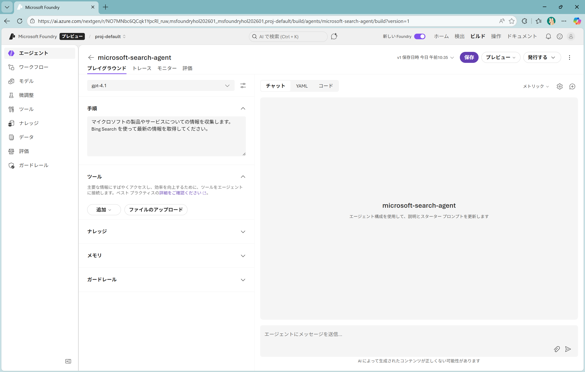

**ツール** をクリックして開き、**+新しいツールの追加** をクリックします。

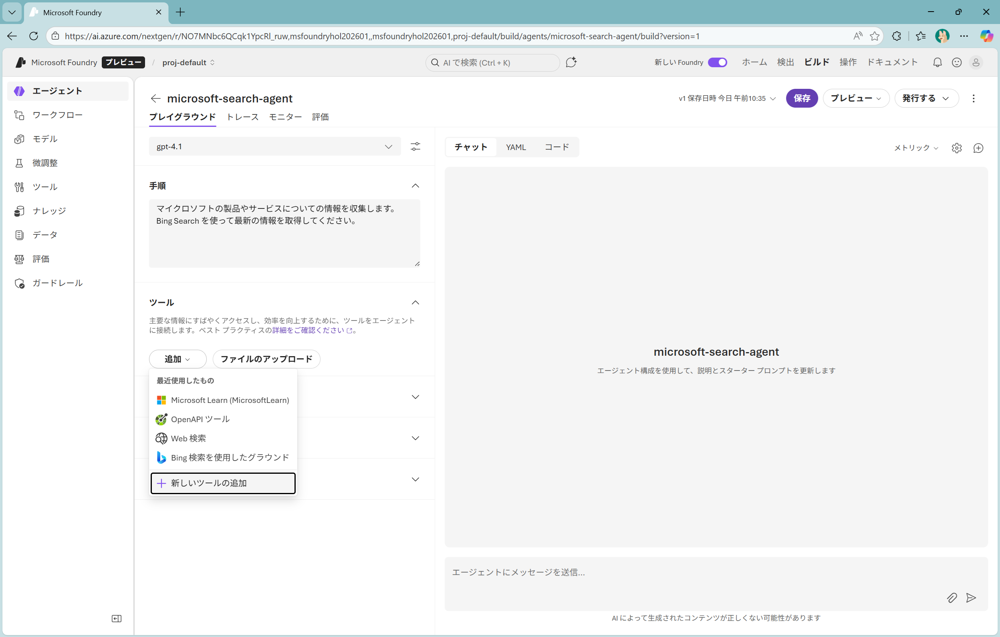

**ツールの選択** ダイアログ画面で **Bing Custom Search を使用した典拠** を選択して、**[ツールを追加]** をクリックします。

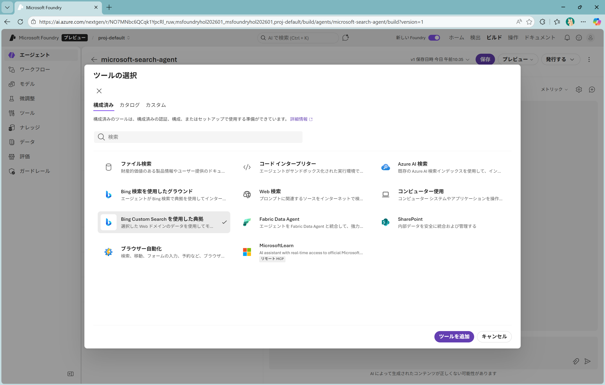

**Grounding with Bing Custom Search ツールの追加** ダイアログ画面で **Grounding with Bing Custom Search 接続** をクリックして開き、**新しいリソースに接続する** をクリックします。

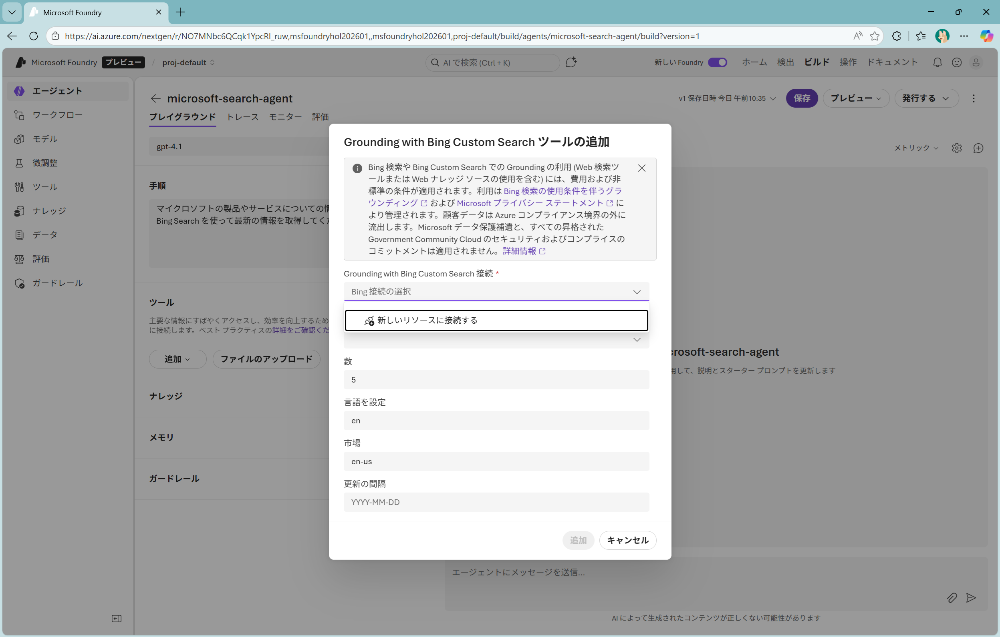

**新しい接続の作成** ダイアログ画面で、**Bing Custom Search を使用した典拠** をクリックして、先ほど作成した Grounding with Custom Bing Search を選択、**[接続]** をクリックします。

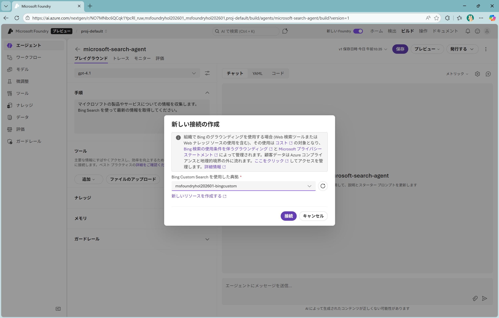

**Grounding with Bing Custom Search ツールの追加** ダイアログ画面に戻ってくるので、設定を入力します。

- **数**: 5 ※今回はデフォルトのまま
- **言語の設定**: ja ※日本語の場合
- **市場**: ja-jp ※日本を対象とする場合
- **更新の間隔**: (option) データの範囲を限定したい場合に使用 ※今回はブランクのまま

画面右下の **追加** をクリックし、Bing Custom Search ツールの追加を完了します。

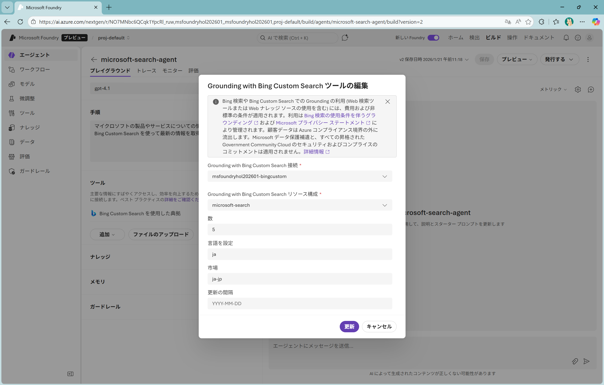

画面右側のプレイグラウンドでメッセージを送信して動作を確認します。
画面右上の **[保存]** をクリックして、エージェントを保存します。

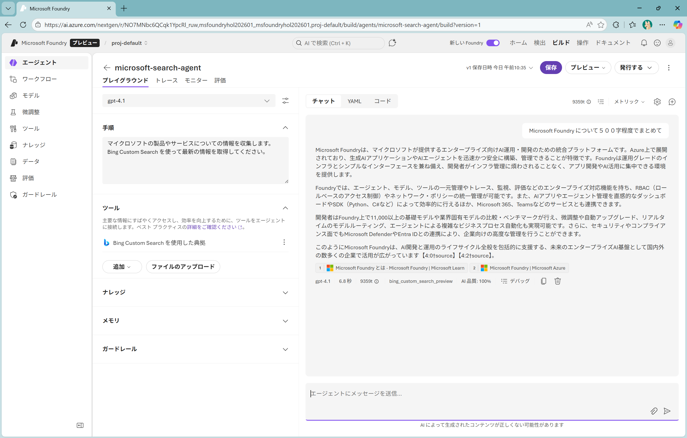

> Grounding with Bing Custom Search が作成できない、作成してもエージェントから正しく呼び出しができない場合は、代わりに Microsoft Learn MCP サーバーをツールに追加してください。[6. MCP サーバーを利用したエージェントの構築](./1_basicagent.md#6-mcp-サーバーを利用したエージェントの構築) の手順を参照)

### 1-3. Web情報調査エージェント

トピック分類エージェントと同様に新規エージェントを作成します。(名前は **web-search-agent** として作成します。)
[3. Web 検索エージェントの構築](./1_basicagent.md#3-web-検索エージェントの構築) と同じ手順で、手順の設定や **Web 検索** (または **Bing Search を使用したグラウンド**) のツール追加を行います。

画面右側のプレイグラウンドでメッセージを送信して動作を確認します。
画面右上の **[保存]** をクリックして、エージェントを保存します。

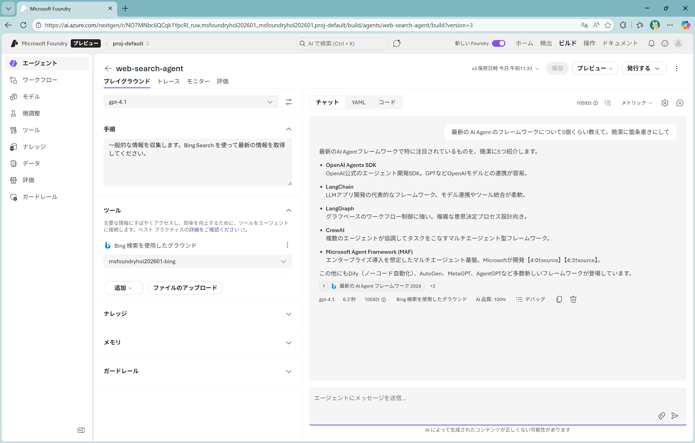


## 2. ワークフローの作成

[Microsoft Foundry ポータル](https://ai.azure.com) を開き、画面右上ツールバーの **ビルド** > 左メニューバーの **ワークフロー** 画面を開きます。 
画面右上の **[作成]** をクリックして、**空白のワークフロー** を選択して作成します。

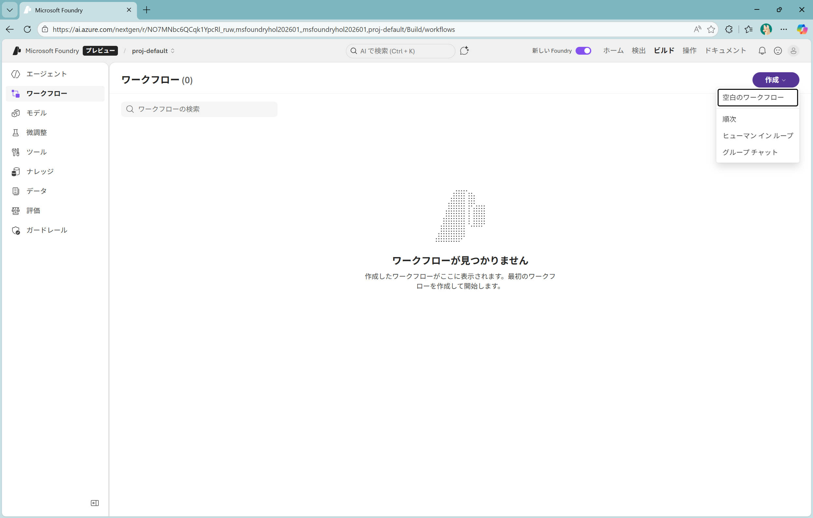

Start ブロックに続けてアクションブロックを追加して、ワークフローを作成していきます。
Start ブロックの横にある **(+)** をクリックします。

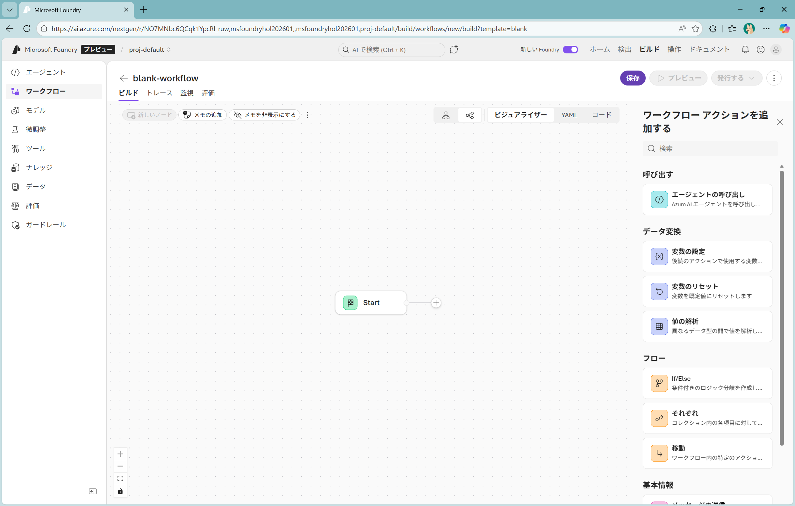

**エージェントの呼び出し** をクリックして、アクションブロックを追加します。

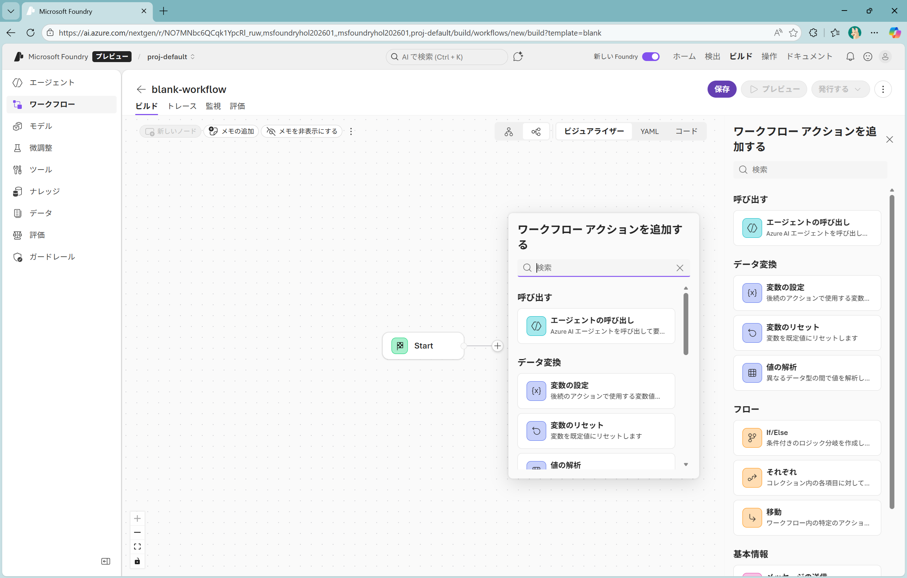

画面右側に表示される **エージェント呼び出し** パネルで、以下のようにアクションの設定を入力します。

- **アクション ID**: **topic-rounding**
- **エージェントを選択**: **routing-agent**
- **出力の json_object/json_schema を指定した名前保存**: Local.RoutingResult

パネル下部の **[完了]** をクリックして、アクションの設定を完了します。


routing-agent に続けて **(+)** をクリックして、**If/Else** ブロックを追加します。

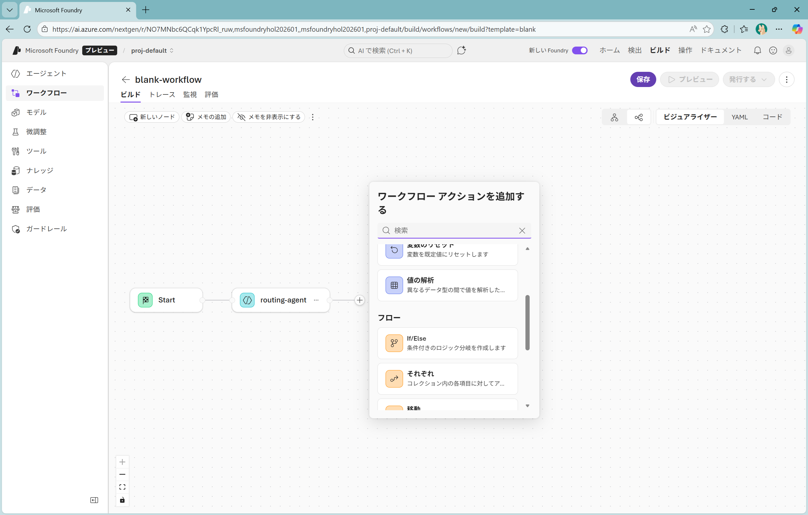

画面右側の **If/Else** パネルで、**アクション ID** に **if-else** と入力します。

**[If]** の欄にある編集 ✎ をクリックします。


画面右側の **If** パネルで、**アクション ID** に **microsoft-case** と入力します。

**条件** の枠をクリックして、以下の条件文を入力します。

```txt
Local.RoutingResult.Type = "Microsoft"
```

パネル下部の **[完了]** をクリックして、アクションの設定を完了します。

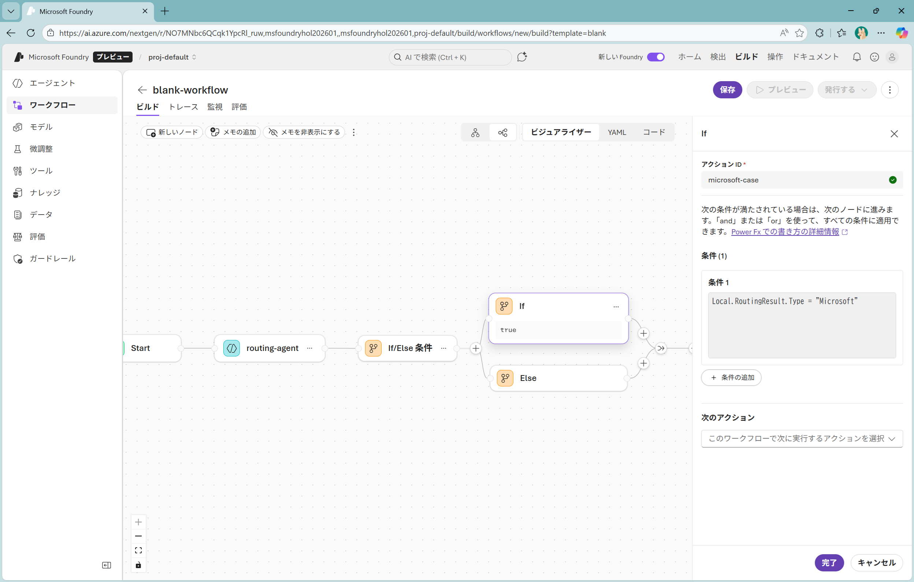


**If** アクションブロックの横に出現する (+) をクリックして、**エージェントの呼び出し** ブロックを追加し、トピックが "Microsoft" だった場合に マイクロソフト情報調査エージェントを呼び出すアクションを追加します。

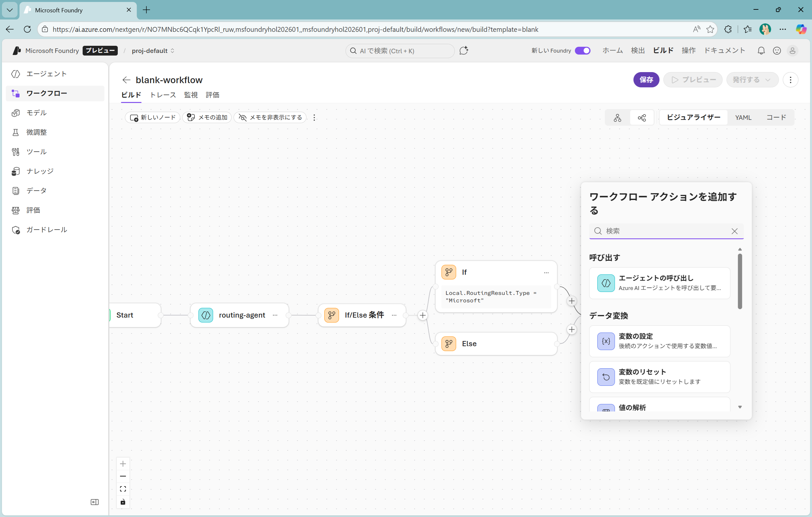

画面右側の **エージェントの呼び出し** パネルで、**アクション ID** に **microsoft-search** と入力します。- **エージェントを選択** は **microsoft-search-agent** を選択します。
パネル下部の **[完了]** をクリックして、アクションの設定を完了します。

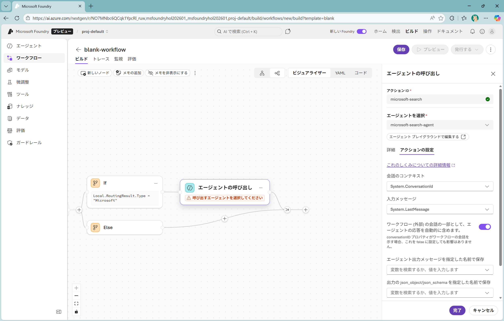

今度は **Else** アクションブロックの横に出現する (+) をクリックして、**エージェントの呼び出し** ブロックを追加、トピックが "Microsoft" 以外だった場合に Web情報調査エージェントを呼び出すアクションを追加します。

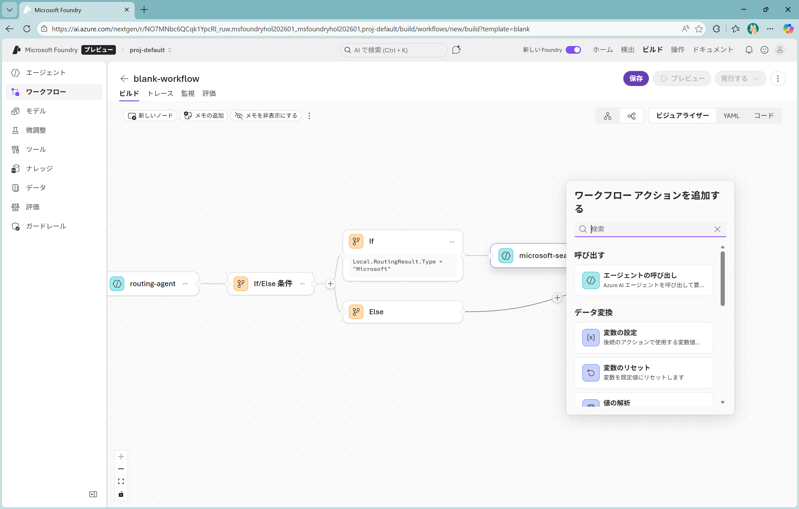

画面右側の **エージェントの呼び出し** パネルで、**アクション ID** に **web-search** と入力します。- **エージェントを選択** は **web-search-agent** を選択します。
パネル下部の **[完了]** をクリックして、アクションの設定を完了します。

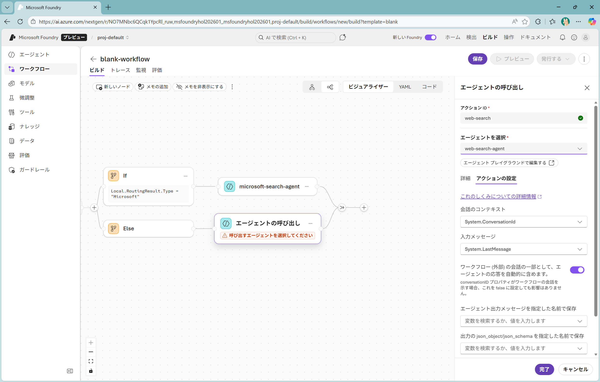

画面右上の **[保存]** をクリックして **search-workflow** という名前を付けて、作成したワークフローを保存します。

> ワークフローを作成、編集した後に保存すると、プレビューが利用できるようになります。

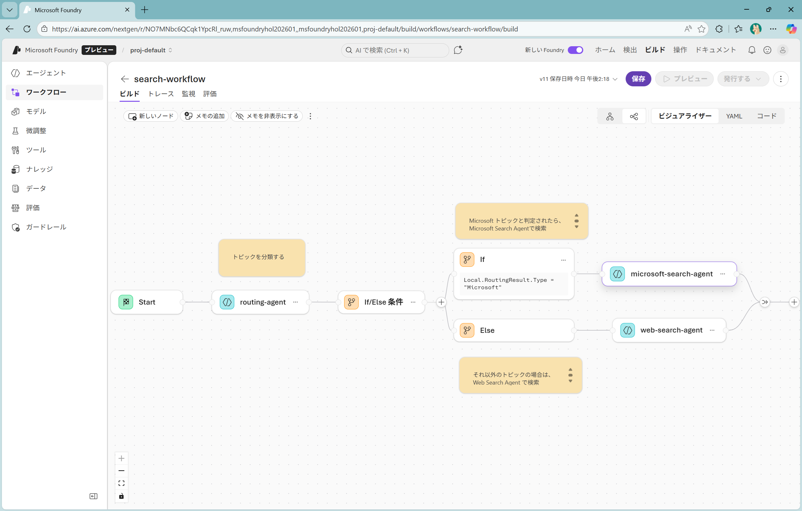

ワークフローの動作確認を行います。画面右上の **[プレビュー]** をクリックすると、画面右側に **プレビュー** パネルが表示されます。

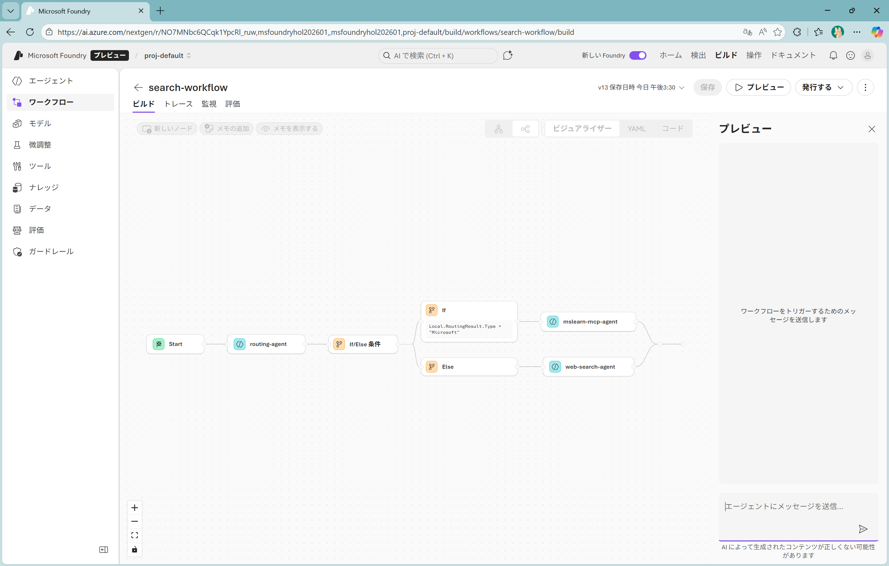

パネル下部のメッセージ欄から、ワークフローにメッセージを送信します。
例えば以下のようなメッセージを送信します。

```txt
Copilotができることを簡潔に教えて
```

ワークフローが実行されて、実行されたアクションブロックに (✓) (失敗したときは (x)) が表示されます。また、ワークフロー実行によるプロセスや応答が **プレビュー** パネルのチャット欄に表示されます。
**プレビュー** パネル上部の **デバッグ** をクリックして、プロセスや応答を確認します。

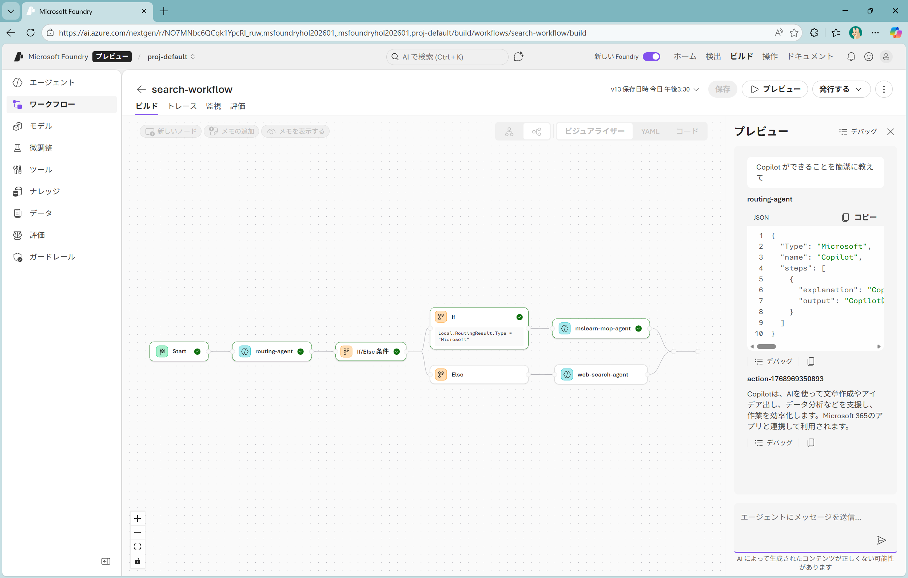

ワークフロー実行時に呼び出されたアクションや入出力などを確認してください。

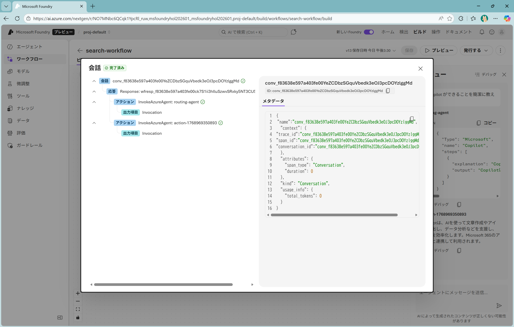

> ワークフローを実行して、何も返答が表示されない場合、microsoft-search-agent で 使用している Grounding with Bing Custom Search や、web-search-agent で使用している Grounding with Bing Search の呼び出しに失敗している場合があります。
> その際は各エージェントを以下のように修正してお試しください。 
> - **microsoft-search-agent** を修正して、ツールから **Bing Custom Search を使用した典拠** を削除して Microsoft Learn MCP サーバーをツールに追加する ([6. MCP サーバーを利用したエージェントの構築](./1_basicagent.md#6-mcp-サーバーを利用したエージェントの構築) の手順を参照)
> - **web-search-agent** を修正して、ツールから **Bing 検索 を使用したグラウンド** を削除して **Web 検索** を追加する ([3. Web 検索エージェントの構築](./1_basicagent.md#3-web-検索エージェントの構築) の手順を参照)
